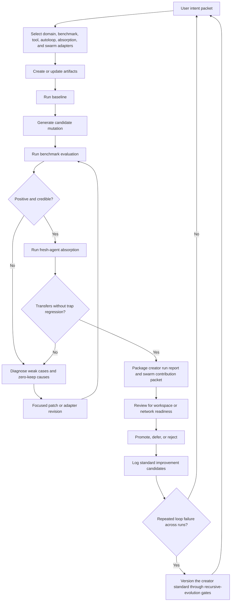
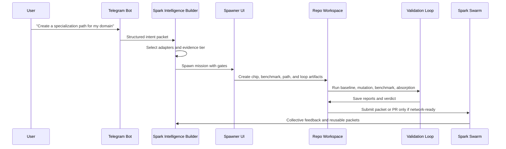

# Adaptive Creator Loop Standard v1

Status: draft v1  
Date: 2026-04-30  
Home: `spark-domain-chip-labs/docs/creator_system/`

## Purpose

Spark creator systems should not assume one benchmark, one domain chip shape, one autoloop policy, or one mastery definition fits every domain. The reusable standard is the loop: define intent, choose adapters, create artifacts, measure baseline, mutate narrowly, evaluate, diagnose weak cases, package evidence, and evolve the standard only when evidence shows the loop itself is failing.

This document defines the first runnable standard for building domain chips, specialization paths, benchmarks, autoloops, and Spark Swarm contribution packets in a way that can adapt by domain without becoming arbitrary.

## Core Thesis

The standard is not a fixed benchmark. The standard is a verified improvement loop.

Every creator run must answer:

1. What domain or tool capability is Spark trying to improve?
2. What evidence surface proves improvement in that domain?
3. What can mutate, and what must stay stable during the run?
4. What weak cases expose the current limit?
5. What fresh-agent test proves the learning transfers into actual use?
6. What packet can be safely shared with Spark Swarm?
7. What did the run teach us about improving the creator standard itself?

If those answers are missing, the system may still be useful as a prototype, but it should not claim mastery or network-ready intelligence.

## What Is Standardized vs Adapted

| Layer | Standardized across domains | Adapted per domain |
| --- | --- | --- |
| Intent | Structured user goal, scope, constraints, success criteria | Domain language, user persona, risk tolerance |
| Domain chip | Capability contract, scoring hooks, doctrine fields, versioning | Knowledge primitives, reasoning rules, tool affordances |
| Benchmark | Manifest, baseline, candidate comparison, trap cases, reports | Cases, rubrics, simulators, outcome metrics |
| Autoloop | Mutation window, keep/reject rule, lineage, rollback, stop conditions | Mutation candidates, search space, pressure tests |
| Absorption | Fresh-agent bundle, held-out cases, score delta, failure notes | Task style, expected outputs, domain-specific traps |
| Swarm packet | Provenance, evidence tier, review state, rollback condition | Insight content, mastery labels, transfer targets |
| Standard evolution | Versioned changes, falsifiable reason, anti-drift gates | New adapters, new benchmark families, domain exceptions |

## Adaptive Loop



## Required Adapters

Each creator run must declare its adapters in `adapter-map.json`. An adapter can be implemented in code, docs, config, or a repo convention, but it must be explicit.

### Domain Adapter

Defines what intelligence means in the domain.

Required fields:

- `domain_name`
- `target_user_or_agent`
- `capabilities`
- `doctrine_or_operating_principles`
- `known_failure_modes`
- `unsafe_or_out_of_scope_claims`
- `baseline_examples`

Examples:

- Startup YC: demand reality, narrow wedge, default alive, design partners, retention quality.
- Prompt engineering: task decomposition, eval design, prompt mutation discipline, failure isolation.
- Tool operation: command planning, API safety, output verification, rollback.

### Benchmark Adapter

Defines the truth surface.

Required fields:

- `benchmark_family`
- `case_manifest`
- `scoring_dimensions`
- `baseline_command_or_protocol`
- `candidate_command_or_protocol`
- `trap_cases`
- `calibration_notes`
- `minimum_evidence_tier`

Benchmark families:

| Family | Best for | Examples |
| --- | --- | --- |
| Fixed-case rubric | Stable reasoning tasks | Startup diagnosis, product strategy, prompt repair |
| Simulator | Dynamic strategy under changing conditions | Agentic startup simulator, market/game simulations |
| Arena/game | Competitive pressure and tradeoffs | Founder Arena, negotiation arena, tool challenge arena |
| Tool-operation | Can the agent execute reliably? | CLI flows, API use, repo edits, browser workflows |
| Artifact-quality | Does the output hold up under review? | PRDs, specs, docs, code patches, decks |
| Retrieval/memory | Can the agent absorb and reuse knowledge? | Fresh-agent bundle tests, held-out task reuse |
| Adversarial/trap | Does it avoid seductive wrong moves? | Vanity metrics, fake PMF, prompt overfitting |
| Longitudinal | Does improvement persist? | Multi-day usage, repeated operator tasks |
| Collective | Can other agents use the packet? | Spark Swarm absorption and review payloads |

### Tool Adapter

Defines how the agent touches real systems.

Required fields:

- `allowed_tools`
- `protected_tools`
- `auth_boundary`
- `local_vs_network_mode`
- `dry_run_mode`
- `verification_command`
- `human_review_required_for`

### Autoloop Adapter

Defines what may mutate.

Required fields:

- `mutation_surface`
- `frozen_surfaces`
- `candidate_generator`
- `keep_rule`
- `reject_rule`
- `max_rounds`
- `stop_conditions`
- `rollback_condition`
- `lineage_log`

Default rule: benchmark weights and success metrics are frozen during a normal capability-improvement loop. They can only mutate inside a separate benchmark-governance loop with its own review.

### Absorption Adapter

Defines how a fresh agent proves the learning is usable.

Required fields:

- `bundle_inputs`
- `fresh_agent_protocol`
- `held_out_cases`
- `expected_behavior_change`
- `score_delta_threshold`
- `trap_regression_policy`
- `failure_summary_template`

### Swarm Adapter

Defines what can leave the workspace.

Required fields:

- `contribution_type`
- `source_repo`
- `commit_or_artifact_hash`
- `evidence_tier`
- `review_state`
- `proposed_packet`
- `rollback_or_deprecation_rule`
- `privacy_and_security_notes`

Workspace contributions can be fast and local. Network contributions should go through structured packets or GitHub PRs, especially when other users or agents may absorb the result.

## Evidence Ladder

| Tier | Meaning | Minimum bar | Allowed claim |
| --- | --- | --- | --- |
| `prototype` | Artifacts exist and smoke-run | Schema loads, one basic task runs | "Runnable draft" |
| `benchmark_signal` | One measured improvement appears | Baseline and candidate compared, report saved | "Promising signal" |
| `focused_pattern` | Weak cases improve | Focused weak-case suite positive, mechanism named | "Useful in these cases" |
| `candidate_review` | Full suite supports it | Full suite positive mean, trap cases stable, lineage logged | "Candidate mastery packet" |
| `transfer_supported` | Works beyond original cases | Simulator, arena, tool, or held-out transfer positive | "Transfer-supported pattern" |
| `network_absorbable` | Safe for other agents | PR or packet review, provenance, rollback, calibration notes | "Swarm-ready contribution" |
| `standard_update` | The creator standard should change | Repeated cross-run failure, recursive gates pass | "Update creator methodology" |

Do not compress these tiers into one score. A high benchmark score with no absorption test is not the same as a reusable mastery packet.

Focused transfer and broad transfer are also different claims. A creator run may be `transfer_supported` from a positive held-out simulator/tool scenario while still carrying a negative `broad_transfer_probe`; that should narrow the claim, not erase the useful signal. For `network_absorbable` and `standard_update`, a negative broad probe is blocking because the packet would otherwise teach other agents or future creator standards to overgeneralize.

## Startup YC Reference Numbers

Startup YC is the current reference path because it has a real loop with measured fresh-agent absorption.

Observed 2026-04-30 evidence:

| Run | Scope | Result | Interpretation |
| --- | --- | --- | --- |
| Full 20-case proof | Saved absorption bundle | `+0.0200` mean delta, 0 trap regressions | Real benchmark signal and candidate-review evidence |
| Weak-5 repeat | Focused weak cases | `+0.0053` mean delta | Useful focused pattern, not enough alone for mastery |
| False-demand patch | Two false-demand cases | `+0.0092`, `+0.0122` | Focused mechanism improved after patch |
| Reliability patch | One reliability case | `+0.0044` | Focused mechanism improved, needs broader repeat |

This is exactly the level of honesty the creator system should preserve: the system improved, but it did not magically become a complete startup oracle. The next claim must be backed by a broader suite, simulator transfer, or held-out operator task.

## Creator Run Artifact Contract

Every runnable creator run should produce this minimum artifact set:

```text
creator-run/
  creator-intent.json
  adapter-map.json
  domain-chip/
    chip.manifest.json
    doctrine.md
    scoring_hooks.json
  specialization-path/
    path.manifest.json
    absorption_bundle.md
  benchmark/
    manifest.json
    cases.jsonl
    scoring_rubric.md
    traps.jsonl
  autoloop/
    policy.json
    mutation_surface.md
    stop_conditions.md
  reports/
    baseline.json
    candidate.json
    weak_case_diagnosis.md
    absorption_summary.json
    creator_run_summary.md
  swarm/
    contribution_packet.json
    review_notes.md
```

Repos may organize files differently, but these contracts must be discoverable by agents.

## Creator Run Acceptance Tests

A new creator system is not ready until it can:

1. Generate a valid intent packet from a user request.
2. Select adapters and explain why each adapter was chosen.
3. Create a domain chip or update an existing one without hiding assumptions.
4. Create a benchmark manifest with at least one trap or adversarial case.
5. Run a baseline and save the result.
6. Run one narrow mutation and compare candidate vs baseline.
7. Diagnose zero-keep or no-gain loops.
8. Produce a fresh-agent absorption bundle or explain why absorption is not applicable.
9. Emit a workspace-only vs network-ready verdict.
10. Package a Swarm contribution packet with provenance and rollback.

## Recursive Standard Evolution

The creator standard can evolve, but it must be treated like a mutation.

Use the recursive-evolution gates before changing the standard:

| Gate | Pass condition |
| --- | --- |
| Causal anchor | The proposed standard change names the concrete loop failure it fixes. |
| Lineage | At least three prior failures or one severe blocking failure justify it. |
| Ghost improvement | The change cannot merely improve wording, confidence, or score cosmetics. |
| Complexity | Added complexity is smaller than the measured gain or risk reduction. |
| Transfer | The change is tested or mapped across at least one other domain. |
| Memory hygiene | Operational residue is not promoted into doctrine. |
| Autonomy | Persistent standard changes have review, rollback, and an evaluation window. |

Standard updates should create:

- `standard_change_proposal.md`
- `standard_change_evidence.json`
- `migration_notes.md`
- `rollback_condition.md`
- `version_bump_note.md`

Default decision policy:

- Approve if every gate passes and at least one independent creator run benefits.
- Defer if the idea is plausible but only narrative evidence exists.
- Reject if it changes success metrics to make a weak run look strong.

## User Flow



The user should not need to understand every internal artifact. They should see:

- what is being created
- what evidence exists
- what is still unproven
- whether it is local-only, workspace-ready, or network-ready
- what the next best run is

## First Runnable Version

The first version should prioritize a dependable thin path over a giant universal platform.

Minimum runnable command shape:

```text
spark-create intent --domain <domain> --goal <goal> --output creator-run/
spark-create adapters --input creator-run/creator-intent.json
spark-create scaffold --input creator-run/adapter-map.json
spark-bench baseline --run creator-run/
spark-loop run --run creator-run/ --rounds 3 --mode local
spark-bench compare --run creator-run/
spark-absorb test --run creator-run/
spark-swarm package --run creator-run/ --mode workspace
```

These command names are illustrative. The contract matters more than the exact CLI names: the workflow must be reproducible, inspectable, and able to stop before network publication.

## Stop-Ship Checks

Stop the creator run if any of these are true:

- No benchmark exists.
- No baseline exists.
- Benchmark weights changed during the same capability-improvement loop.
- The mutation surface is not declared.
- A score improved but all examples came from the same training or prompt context.
- Trap cases regressed.
- Fresh-agent absorption is claimed but no fresh-agent protocol ran.
- A Swarm packet lacks provenance or rollback.
- Private workspace material is being pushed to network mode without explicit policy.
- The claimed evidence tier is higher than the saved reports support.

## How This Applies Beyond Startup YC

For every new domain, keep the loop and swap the adapters.

Examples:

- A legal-drafting path may need artifact-quality, adversarial citation, and policy-risk adapters.
- A coding-agent path may need repo-operation, test-suite, code-review, and rollback adapters.
- A sales-operator path may need simulator, conversation-quality, CRM-tooling, and privacy adapters.
- A research path may need source-quality, contradiction, citation, and synthesis adapters.
- A product-builder path may need PRD quality, user-flow, implementation, and live QA adapters.

The goal is not to make every domain look like Startup YC. The goal is to make every domain prove improvement with the right evidence.

## Next Implementation Hooks

1. Add `adapter-map.json` generation to the creator CLI or Builder service.
2. Add a benchmark-family selector to Telegram and Spawner UI mission creation.
3. Add Kanban gate states for `prototype`, `benchmark_signal`, `focused_pattern`, `candidate_review`, `transfer_supported`, and `network_absorbable`.
4. Add Swarm packet validation that rejects unsupported evidence-tier claims.
5. Add a standard-change proposal template so the creator methodology can improve without quiet drift.
