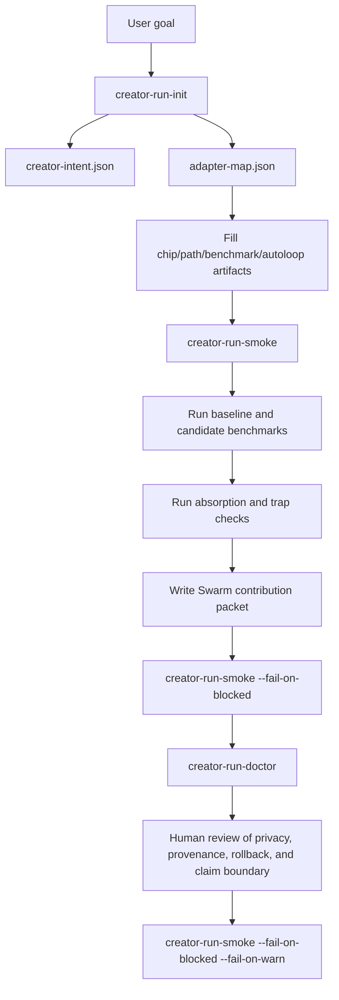

# Creator Run Golden Path V1

This is the first complete local path for turning a user goal into a benchmarked Spark creator run without relying on unfinished product surfaces.

The path is intentionally CLI-first. Builder, Telegram, Spawner UI, Canvas, and Kanban can call the same commands later, but V1 proves the contract in a repo before product wiring hardens.

## Goal

A Spark agent should be able to:

1. capture the user's domain and goal,
2. scaffold a creator-run workspace,
3. fill domain, benchmark, tool, autoloop, absorption, and Swarm packet artifacts,
4. validate whether the run is blocked, ready for baseline, or ready for Swarm packet review,
5. produce concrete repair steps when the run is not ready,
6. preserve claim boundaries so focused improvement is not overstated as broad mastery.
7. claim only the strongest evidence tier supported by the weakest passing gate.

## Happy Path



## Commands

Create a run:

```bash
python -m chip_labs.cli creator-run-init \
  --output-dir runs/<run-name> \
  --domain "<domain or tool>" \
  --goal "<plain-language goal>" \
  --source-channel local
```

Check template health before generating new runs:

```bash
python -m chip_labs.cli creator-run-template-check --fail-on-blocked
```

Check run readiness:

```bash
python -m chip_labs.cli creator-run-smoke runs/<run-name> --fail-on-blocked
```

Before writing the Swarm packet, fill the evidence ladder:

```text
docs/creator_system/templates/creator-run/evidence-ladder.template.md
```

Use `PROMOTION_GATES_AND_EVIDENCE_TIERS.md` to decide the strongest safe claim.

Get a repair plan:

```bash
python -m chip_labs.cli creator-run-doctor runs/<run-name>
```

Strict publication check:

```bash
python -m chip_labs.cli creator-run-smoke runs/<run-name> --fail-on-blocked --fail-on-warn
```

## What The Agent Should Learn

The creator run is not only a folder shape. It is a learning loop.

| Layer | What improves | What must not drift |
| --- | --- | --- |
| Domain chip | Reasoning hooks, doctrine, failure detection, operating principles | Benchmark scoring definitions and safety boundaries |
| Benchmark | Cases, traps, held-out coverage, calibration notes | Expected answers should not be rewritten to flatter the candidate |
| Specialization path | Skill bundles, retrieval docs, practice sequences, tool-use procedures | Claims must stay tied to measured evidence |
| Autoloop | Mutation candidates, keep/reject logic, rollback rules | Mutation surface should not silently widen |
| Absorption | Fresh-agent learning quality and transfer | Conversational residue must not become doctrine |
| Swarm packet | Shareable insight, mastery, or upgrade | Focused transfer must not be sold as broad mastery |

## Verdict Routing

| Smoke verdict | Meaning | Next action |
| --- | --- | --- |
| `blocked` | Required schema, fields, or evidence failed. | Stop and run `creator-run-doctor`. |
| `prototype` | Intent and adapters exist; core artifacts are missing. | Build chip/path/benchmark/autoloop artifacts. |
| `ready_for_baseline` | Core artifacts exist; benchmark reports are missing. | Run baseline, candidate, absorption, and trap checks. |
| `ready_for_swarm_packet` | Reports and packet exist. | Review publication boundaries, then run strict smoke if publishing. |

The smoke verdict answers artifact readiness. The evidence tier answers claim strength. A run can be `ready_for_swarm_packet` and still be unsafe to publish broadly if its evidence tier or broad-transfer probe does not support network absorption.

## V1 Boundary

This path is production-useful as a local and repo-based contract.

It does not finalize product integration for Spark Intelligence Builder, Telegram, Spawner UI, Canvas, or Kanban. Those surfaces should call this contract later, after their builder, memory, conversation, and mission-control interactions are polished.
