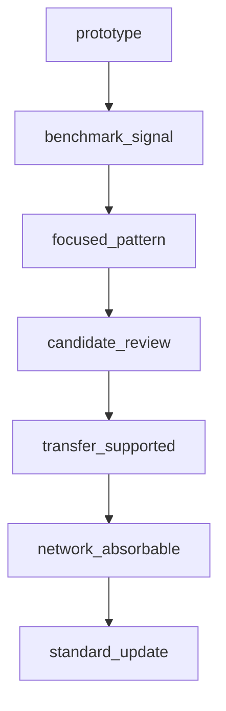
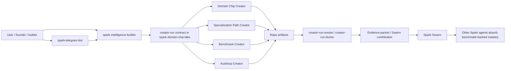
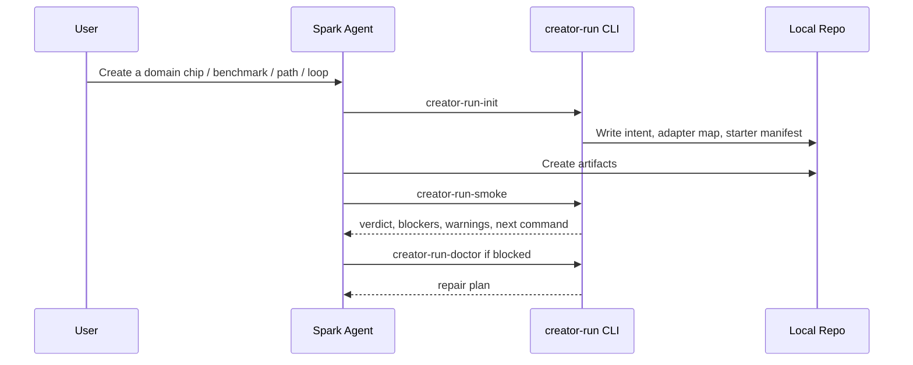
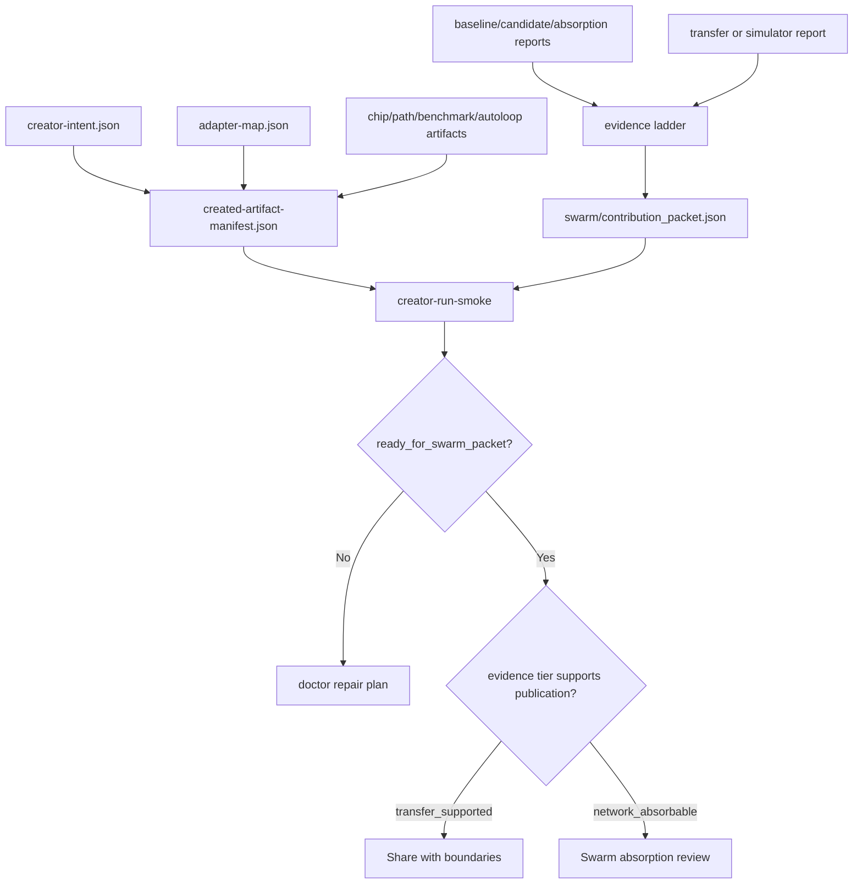
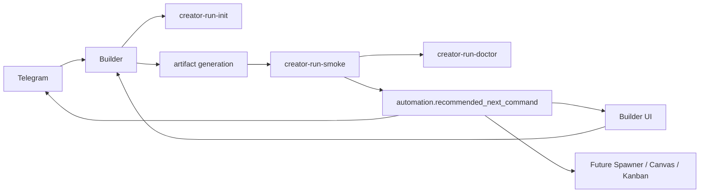
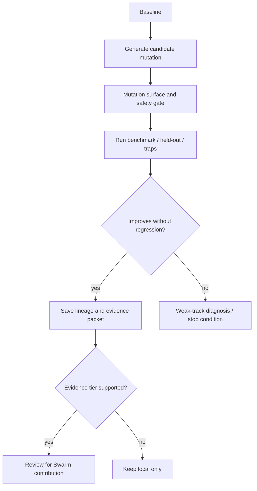
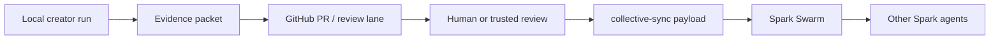
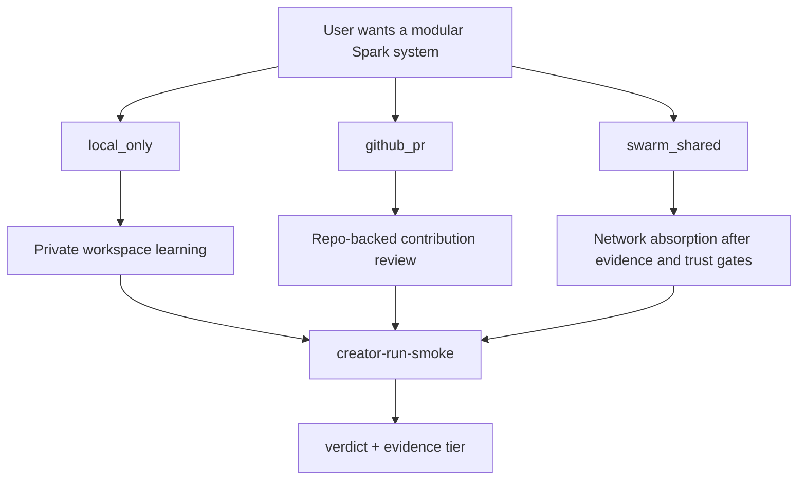

# Spark Creator System Community Handoff

Date: 2026-05-01  
Repo: `C:\Users\USER\Desktop\spark-domain-chip-labs`  
Current branch: `main`  
Primary docs folder: `C:\Users\USER\Desktop\spark-domain-chip-labs\docs\creator_system`

## Purpose

This handoff explains what has been built so far, what is currently proven, what is still missing, and how the Spark creator standards should become publishable for community use.

The target community outcome is simple:

> A user should be able to ask Spark to create a domain chip, benchmark pack, specialization path, autoloop, and Swarm contribution system for their own domain or tool, then verify whether that system is actually improving agent behavior.

The important part is not scaffolding files. The important part is proving that a created system makes an agent better in a way that survives benchmarks, fresh cases, transfer checks, and publication review.

## Executive Status

The creator system is now a strong alpha standard.

It has:

- A documented methodology for domain chips, specialization paths, benchmarks, autoloops, and Swarm packets.
- A runnable CLI contract for initializing, validating, diagnosing, and checking creator-run workspaces.
- JSON schema anchors and templates for all major creator-run artifacts.
- A Startup YC reference fixture that passes the current smoke gate.
- Evidence-tier rules that prevent weak local wins from being mislabeled as network-wide mastery.
- A deferred product-flow plan for Builder, Telegram, Spawner UI, Canvas, and Kanban.

It does not yet have:

- A polished public one-command creator product.
- Multi-seed, human-calibrated generator proof across many production domains.
- A dedicated public `spark-creator` repo decision.
- Full product wiring into Builder, Telegram, Spawner UI, Canvas, or Kanban.
- Multi-seed, human-calibrated, publication-reviewed evidence for network absorption.

The honest verdict:

> We have a real creator standard and one credible golden reference. We are not done proving that the creator system can reliably generate equally strong systems for every community use case.

## Continuation Update

After this handoff was archived, the next proof slice landed in this repo:

- generator acceptance tests now create full creator-run systems from fresh
  briefs in temporary clean workspaces;
- `creator-run-smoke --recompute` now distinguishes coherent saved evidence
  from freshly rerun evidence when supported provenance is present;
- artifact-quality, tool-operation, MiroFish content simulation,
  doctor-security, Startup YC operator, and retrieval-memory proof domains are
  documented and covered by focused tests;
- `creator-mission-status` now emits one canonical read-only packet for Builder,
  Telegram, Spawner, Canvas, and Kanban;
- product consumer branches and PRs are recorded in
  `PRODUCT_SURFACE_CONSUMER_BRANCHES_2026-05-01.md`;
- `.github/workflows/creator-system.yml` runs full `src/chip_labs` and `tests`
  lint, proof-domain tests, strict Startup YC smoke check, and template check.

This does not change the publication boundary: Startup YC remains
`transfer_supported`, not `network_absorbable`, and product surfaces remain
read-only consumers until their runtime workflows are separately implemented and
reviewed.

## What Has Been Built

### 1. Creator-run CLI contract

The current local interface lives in `src/chip_labs/creator_run.py` and is exposed through `src/chip_labs/cli.py`.

Commands:

```bash
python -m chip_labs.cli creator-run-init --output-dir runs/<run-name> --domain "<domain>" --goal "<goal>"
python -m chip_labs.cli creator-run-smoke runs/<run-name>
python -m chip_labs.cli creator-run-doctor runs/<run-name>
python -m chip_labs.cli creator-run-template-check --fail-on-blocked
```

What this gives us:

- A stable way to start a creator run.
- A stable way to classify readiness.
- A machine-readable result for product surfaces.
- A human-readable repair plan.
- A check that templates have not drifted from the contract.

### 2. Creator-run verdicts

The smoke gate emits a verdict:

| Verdict | Meaning | Best next action |
| --- | --- | --- |
| `blocked` | Required schema, foundation fields, evidence, or claim support failed. | Stop and repair blockers. |
| `prototype` | Intent and adapters exist, but core artifacts are missing. | Create chip/path/benchmark/autoloop artifacts. |
| `ready_for_baseline` | Core artifacts exist, but benchmark reports are missing. | Run baseline, candidate, absorption, and trap checks. |
| `ready_for_swarm_packet` | Reports and contribution packet exist. | Review evidence, privacy, rollback, traps, and publication boundary. |

The result also includes:

- `status_counts`
- `blocking_checks`
- `warning_checks`
- `missing_paths`
- `next_actions`
- `automation.blocked`
- `automation.ci_exit_code`
- `automation.recommended_next_command`

These fields are the future handoff surface for Builder, Telegram, Spawner UI, Canvas, Kanban, CI, and local agents.

### 3. Evidence ladder and promotion gates

The creator system now separates local experimentation from network contribution.



Tier meanings:

| Tier | Meaning | Community publication stance |
| --- | --- | --- |
| `prototype` | Artifact shape exists. | Local only. |
| `benchmark_signal` | Some measured improvement exists. | Local or experimental only. |
| `focused_pattern` | A mechanism works on a narrow target. | Shareable as a narrow lesson with boundaries. |
| `candidate_review` | Baseline, candidate, absorption, traps, provenance, and rollback are present. | Review candidate. |
| `transfer_supported` | The pattern transfers to a simulator, arena, tool benchmark, held-out suite, or adjacent family. | Shareable with boundaries. |
| `network_absorbable` | Broad transfer, privacy, provenance, rollback, review, and calibration pass. | Safe for Swarm absorption. |
| `standard_update` | The creator methodology itself should evolve. | Requires strict review. |

The important rule:

> A run can be `ready_for_swarm_packet` as an artifact verdict but still not be `network_absorbable` as an evidence claim.

### 4. Artifact and schema surface

The current creator-run surface includes:

- `creator-intent.json`
- `adapter-map.json`
- `created-artifact-manifest.json`
- domain chip artifacts
- specialization path artifacts
- benchmark pack artifacts
- autoloop policy artifacts
- baseline/candidate/absorption/transfer reports
- evidence ladder
- Swarm contribution packet

Schema anchors:

- `docs/creator_system/schemas/creator-intent.schema.json`
- `docs/creator_system/schemas/adapter-map.schema.json`
- `docs/creator_system/schemas/created-artifact-manifest.schema.json`
- `docs/creator_system/schemas/benchmark-pack-manifest.schema.json`
- `docs/creator_system/schemas/loop-policy-manifest.schema.json`
- `docs/creator_system/schemas/smoke-result.schema.json`
- `docs/creator_system/schemas/doctor-result.schema.json`
- `docs/creator_system/schemas/template-check-result.schema.json`
- `docs/creator_system/schemas/swarm-contribution-packet.schema.json`

Template surface:

- `docs/creator_system/templates/creator-run/creator-intent.template.json`
- `docs/creator_system/templates/creator-run/adapter-map.template.json`
- `docs/creator_system/templates/creator-run/created-artifact-manifest.template.json`
- `docs/creator_system/templates/creator-run/benchmark-pack.template.md`
- `docs/creator_system/templates/creator-run/autoloop-policy.template.json`
- `docs/creator_system/templates/creator-run/evidence-ladder.template.md`
- `docs/creator_system/templates/creator-run/swarm-contribution-packet.template.json`
- `docs/creator_system/templates/creator-run/standard-change-proposal.template.md`
- `docs/creator_system/templates/creator-run/specialization-path-contract.template.md`
- `docs/creator_system/templates/creator-run/creator-run-summary.template.md`

### 5. Startup YC golden reference fixture

Reference fixture:

`C:\Users\USER\Desktop\spark-domain-chip-labs\docs\creator_system\examples\startup-yc-creator-run`

Current expected state:

- Smoke verdict: `ready_for_swarm_packet`
- Evidence tier: `transfer_supported`
- Blockers: `0`
- Warnings: `0`
- Strict smoke should pass

Startup YC evidence currently represented in the fixture:

- Full 20-case fresh-agent absorption proof:
  - no-pack mean: `0.6803`
  - validated-pack mean: `0.7003`
  - mean delta: `+0.0200`
  - trap regressions: `0`
- Startup YC fresh validation suite:
  - 12 scenarios
  - 12 wins
  - 0 losses
  - 0 ties
  - 0 skips
  - mean scenario delta: `+0.0560`
  - min scenario delta: `+0.0144`
  - max scenario delta: `+0.1410`

Why it remains `transfer_supported`, not `network_absorbable`:

- Multi-seed fresh validation is still needed.
- Human/operator calibration is still needed.
- Publication review is still needed.
- GitHub PR based contribution workflow is not finalized.

## System Map



## Repository Roles

### spark-domain-chip-labs

Current home for the creator methodology.

Owns:

- creator-system docs
- quality rubrics
- creator-run CLI contract
- schema anchors
- template surface
- Startup YC reference fixture
- cross-chip methodology research

This is the right temporary home while standards are still evolving.

### future spark-creator repo

Likely future public home once the standard stabilizes.

Should own:

- community quickstart
- packaged creator-run CLI
- public templates
- examples for several domains
- generator acceptance tests
- contribution workflow docs

Open decision:

> Split into `spark-creator` when the generator acceptance tests and public quickstart are strong enough that the repo can stand alone.

### spark-intelligence-builder

Future runtime core and product API layer.

Should own:

- identity and session continuity
- provider and auth configuration
- domain chip attachment
- specialization path readiness
- Builder calls into creator-run commands
- artifact generation orchestration

Should not own:

- benchmark truth
- Telegram ingress
- mission-control state
- Swarm authority

### spark-telegram-bot

Future conversational entry point.

Should own:

- normal-language goal collection
- progress summaries
- creator-run next actions
- human-friendly repair prompts

Should call Builder or creator-run contracts rather than maintaining its own workflow truth.

### spawner-ui, Canvas, and Kanban

Deferred product-flow surface.

Should eventually own:

- mission visualization
- creator pipeline stages
- benchmark gate visibility
- run trace views
- artifact links
- blocked/ready state mapping

This is intentionally deferred until Builder, memory, conversations, and interaction surfaces are polished enough to avoid another confusing control plane.

### Spark Swarm

Collective intelligence layer.

Should own:

- ingestion of benchmark-backed insights
- collective-sync payloads
- mastery records
- upgrade suggestions
- contribution review boundaries
- shared learning for other agents

Should not absorb raw local residue, unreviewed benchmark wins, or packets without evidence lanes.

## Connection Systems

### Local workspace to creator-run



### Creator-run to Swarm packet



### Product-flow direction



The product-flow contract exists in docs, but the actual product wiring is deferred.

## Spark's Unique Angles

### Domain chips

Domain chips should make an agent better at a domain or tool by attaching:

- doctrine
- source registry
- evaluation hooks
- suggestion hooks
- packet generation rules
- benchmark bridge
- watchtower signals

The chip should know when it is in-domain and when it is not.

### Specialization paths

A specialization path turns repeated practice into staged mastery.

It should define:

- path manifest
- progression stages
- benchmark gates
- learning artifacts
- absorption bundles
- weak-case ledger
- promotion rules

The path is where static knowledge becomes operational behavior.

### Benchmarks

Benchmarks are the truth surface.

They should include:

- fixed visible cases
- hidden or fresh cases
- trap cases
- calibration examples
- regression checks
- simulator or arena transfer where useful
- score reports with boundaries

No single benchmark family proves mastery across all domains.

### Autoloops

Autoloops mutate controlled surfaces and keep only improvements that survive checks.



An autoloop should improve a capability, not merely learn how to phrase a benchmark answer.

### Spark Swarm

Spark Swarm should turn validated local learning into shared mastery.

The network route should usually be:



This keeps community contribution safer than direct raw network sharing.

## Planning Status

| Phase | Status | Notes |
| --- | --- | --- |
| Phase 1: Canonical creator docs | Mostly complete | PRD, flowcharts, research ledger, playbook, protocol, golden path, production readiness, and backlog docs exist. |
| Phase 2: Creator packet/schema anchors | Initial complete | Core schemas and templates exist. Need downstream adoption and stricter JSON Schema validation in the CLI. |
| Phase 3: Golden Startup YC reference | Strong alpha | Fixture passes current smoke and strict smoke. Needs multi-seed/human review before network absorption. |
| Phase 4: Generator acceptance tests | Initial complete | Tests now create working creator-run systems from fresh briefs in temporary workspaces, including recompute smoke. |
| Phase 5: Product flow | Deferred | Builder, Telegram, Spawner, Canvas, and Kanban integration documented but intentionally not finalized. |
| Phase 6: Community publication | Not done | Need public quickstart, repo decision, packaging, contribution model, and security/trust docs. |

## Current Gaps

### Gap 1: Generator proof

Status: initial executable proof exists.

Covered acceptance tests:

- create a domain chip from a brief and run hook smoke tests
- create a benchmark pack and run baseline
- create a specialization path and pass creator-run smoke
- create an autoloop policy and run one keep/revert round
- create a Swarm contribution packet from reports
- run the full flow in a temporary clean checkout

Remaining work:

- add more generated domains beyond the current proof fixtures
- add multi-seed validation before any network-absorbable claim

### Gap 2: Recompute mode

Status: initial supported-provenance mode exists.

`creator-run-smoke --recompute` now checks saved baseline, candidate, and
absorption reports against current source artifacts when reports carry supported
`creator_generator_v1` or `artifact_quality_v1` provenance and input hashes.
The curated Startup YC fixture also has `startup_yc_external_v1` source-report
checks for transfer, absorption, broad-transfer, and Swarm packet evidence when
the referenced external reports are locally available. These checks compare
saved evidence to source reports; they do not yet rerun the external benchmark
systems end to end.

Remaining work:

- end-to-end source-repo rerunners for Startup Bench and specialization-path
  reports
- broader provider-specific provenance adapters
- multi-seed recompute and calibration before stronger claims

### Gap 3: Multi-domain proof

Startup YC is the gold reference, but the standard must work beyond Startup YC.

Needed reference domains:

- one tool-operation domain
- one artifact-quality domain
- one simulator-heavy domain
- one retrieval/memory domain
- one adversarial/security domain

### Gap 4: Network contribution security

Community contribution should favor repo-backed PR review over raw direct sharing.

Needed:

- GitHub PR packet route
- source provenance requirements
- privacy scrub checks
- malicious packet quarantine
- packet rollback/deprecation policy
- reviewer checklist for `network_absorbable`

### Gap 5: Product connection flow

The earlier access-token friction showed that the connection flow must not require repeated manual token pasting.

Needed:

- Builder-owned auth/session continuity
- local development fallback that reads safe local config
- clear separation between local workspace use and network contribution
- no committed secrets
- no raw tokens in docs or prompts

### Gap 6: Benchmark calibration

Benchmarks can become fake if they only reward the loop's own visible target.

Needed:

- hidden/fresh case rotation
- trap regression bands
- human/operator calibration examples
- multi-seed simulator runs where relevant
- score uncertainty or confidence ranges
- anti-gaming checks for style-only improvements

### Gap 7: Public community education

The docs are agent-readable but not yet polished for a first-time community builder.

Needed:

- public README
- "create your first domain chip" tutorial
- "create your first benchmark" tutorial
- "create your first autoloop" tutorial
- "when not to publish to Swarm" guide
- copy-paste starter commands
- small glossary

## What Is Ready

Ready now:

- Use `spark-domain-chip-labs/docs/creator_system` as the agent-readable methodology hub.
- Use `creator-run-init`, `creator-run-smoke`, `creator-run-doctor`, and `creator-run-template-check` as the local contract.
- Use Startup YC as the first reference fixture.
- Use `transfer_supported` as the honest current claim for Startup YC.
- Use the Phase 2 backlog as future product-flow guidance.

Not ready yet:

- Claiming Startup YC as fully mastered or network-absorbable.
- Publishing this as a one-command public product.
- Letting Swarm absorb community packets without PR/review/trust gates.
- Finalizing Spawner/Canvas/Kanban creator surfaces before Builder and interaction flows are polished.

## Recommended Next Phase

The next phase should focus on proving that the creator system can generate new working systems, not just validate the Startup YC reference.

Recommended order:

1. Add generator acceptance tests in this repo.
2. Add JSON Schema validation to the CLI where practical.
3. Add recompute/provenance mode for benchmark reports.
4. Create one smaller second reference domain.
5. Write the community quickstart.
6. Decide whether to split a public `spark-creator` repo.
7. Only then wire Builder, Telegram, Spawner, Canvas, and Kanban product surfaces.

## Publication Model

Community users should have three lanes:



Lane rules:

- `local_only`: safest default, useful for private workspace improvement.
- `github_pr`: preferred community contribution route, reviewable and auditable.
- `swarm_shared`: only after evidence tier and trust gates support absorption.

## Full Path Index

Core handoff:

- `C:\Users\USER\Desktop\spark-domain-chip-labs\docs\creator_system\CREATOR_SYSTEM_COMMUNITY_HANDOFF_2026-05-01.md`

Main docs:

- `C:\Users\USER\Desktop\spark-domain-chip-labs\docs\creator_system\README.md`
- `C:\Users\USER\Desktop\spark-domain-chip-labs\docs\creator_system\CREATOR_SYSTEM_MASTER_PLAN.md`
- `C:\Users\USER\Desktop\spark-domain-chip-labs\docs\creator_system\CREATOR_SYSTEM_PRD_V1.md`
- `C:\Users\USER\Desktop\spark-domain-chip-labs\docs\creator_system\CREATOR_SYSTEM_FLOWCHARTS.md`
- `C:\Users\USER\Desktop\spark-domain-chip-labs\docs\creator_system\CREATOR_SYSTEM_RESEARCH_LEDGER.md`
- `C:\Users\USER\Desktop\spark-domain-chip-labs\docs\creator_system\ADAPTIVE_CREATOR_LOOP_STANDARD.md`
- `C:\Users\USER\Desktop\spark-domain-chip-labs\docs\creator_system\PROMOTION_GATES_AND_EVIDENCE_TIERS.md`
- `C:\Users\USER\Desktop\spark-domain-chip-labs\docs\creator_system\CREATOR_RUN_PRODUCTION_READINESS_V1.md`
- `C:\Users\USER\Desktop\spark-domain-chip-labs\docs\creator_system\CREATOR_RUN_GOLDEN_PATH_V1.md`
- `C:\Users\USER\Desktop\spark-domain-chip-labs\docs\creator_system\AGENT_CREATOR_PLAYBOOK.md`
- `C:\Users\USER\Desktop\spark-domain-chip-labs\docs\creator_system\BENCHMARK_AND_AUTOLOOP_PROTOCOL.md`
- `C:\Users\USER\Desktop\spark-domain-chip-labs\docs\creator_system\PHASE_2_PRODUCT_FLOW_BACKLOG.md`
- `C:\Users\USER\Desktop\spark-domain-chip-labs\docs\creator_system\TELEGRAM_BUILDER_SPAWNER_CREATOR_FLOW.md`

Reference fixture:

- `C:\Users\USER\Desktop\spark-domain-chip-labs\docs\creator_system\examples\startup-yc-creator-run`

Implementation:

- `C:\Users\USER\Desktop\spark-domain-chip-labs\src\chip_labs\creator_run.py`
- `C:\Users\USER\Desktop\spark-domain-chip-labs\src\chip_labs\cli.py`

Tests:

- `C:\Users\USER\Desktop\spark-domain-chip-labs\tests\test_creator_run.py`
- `C:\Users\USER\Desktop\spark-domain-chip-labs\tests\test_creator_run_examples.py`

## Verification Commands

Last verified in this repo on 2026-05-01:

- `creator-run-template-check --fail-on-blocked`: `57 pass / 0 warn / 0 fail`
- Startup YC strict smoke: `68 pass / 0 warn / 0 fail`
- Startup YC doctor: `ready_for_swarm_packet`, `transfer_supported`, publication review step only
- Focused creator tests: `29 passed`

Focused creator tests:

```bash
python -m pytest tests/test_creator_run.py tests/test_creator_run_examples.py -q
```

Template surface:

```bash
python -m chip_labs.cli creator-run-template-check --fail-on-blocked
```

Startup YC fixture:

```bash
python -m chip_labs.cli creator-run-smoke docs/creator_system/examples/startup-yc-creator-run --fail-on-blocked --fail-on-warn
```

Doctor:

```bash
python -m chip_labs.cli creator-run-doctor docs/creator_system/examples/startup-yc-creator-run
```

## Archive Continuation Notes

These notes exist so this chat can be archived without losing working context.

### Current repo state after this handoff

Last pushed creator-system commit:

- `ae72f07 Document creator system community handoff`

The repo also contains unrelated dirty and untracked workspace files that were intentionally not touched by this handoff. A new agent should run `git status --short` before editing and should stage only files relevant to the current task.

Known unrelated dirty paths at the time this was written:

- `PROJECT.md`
- `src/chip_labs/mirofish/personas.py`
- `src/chip_labs/mirofish/simulation.py`
- many untracked docs/research/viz files outside `docs/creator_system`
- an untracked `nul` path

Do not revert these without explicit user approval.

### Things easy to overlook

1. Startup YC is stronger than it was, but it is still not a final network-wide mastery claim.
   - Current tier: `transfer_supported`
   - Not yet: `network_absorbable`
   - Reason: multi-seed validation, human/operator calibration, privacy review, rollback review, and publication approval are still missing.

2. `ready_for_swarm_packet` is an artifact-readiness verdict, not automatic Swarm absorption.
   - It means the packet exists and passes local checks.
   - It does not mean the network should absorb it without review.

3. The current smoke gate separates saved-evidence validation from supported recompute.
   - Normal smoke validates saved evidence and claim boundaries.
   - `--recompute` reruns supported provenance-tagged generated reports.
   - It still does not fully rerun external Startup Bench or specialization-path source reports.

4. The creator system validates a curated golden fixture and generated clean-workspace runs.
   - The next proof is breadth: more domains, more seeds, and more calibrated operators.

5. Product wiring is intentionally deferred.
   - Do not finalize Spawner/Canvas/Kanban creator surfaces yet.
   - Builder, memory, conversation, auth, and interaction surfaces need polish first.

6. Community contribution should default to safer lanes.
   - Local workspace learning is fine.
   - Network contribution should usually go through GitHub PR/review.
   - Raw direct packet sharing is risky until trust boundaries are complete.

7. Domain Chip Creator and Autoloop Creator should stay separate but contract-bound.
   - Domain Chip Creator can emit loop metadata and hooks.
   - Autoloop Creator should own mutation policy, keep/revert gates, benchmark governance, and promotion rules.

8. Startup YC is the reference implementation, not the universal shape.
   - Other domains may need tool-operation, artifact-quality, simulator, memory, adversarial, or longitudinal benchmark families.
   - The reusable standard is the loop and evidence ladder, not the specific Startup YC benchmark design.

### Best next work order

The next session should not start by adding more broad docs. The most useful next work is executable proof:

1. Add generator acceptance tests for creator outputs.
2. Add JSON Schema validation where practical inside `creator-run-smoke` or a companion validator.
3. Add recompute/provenance mode for benchmark reports.
4. Create one small second reference domain to prove the standard is not Startup-YC-only.
5. Write a public community quickstart after the generator proof exists.
6. Decide whether to split `spark-creator` only after the quickstart and acceptance tests are credible.

### Stop/do-not-do list

- Do not claim `network_absorbable` because strict smoke passes.
- Do not wire creator flows into Spawner/Canvas/Kanban as the next immediate task.
- Do not commit secrets, access tokens, session tokens, or local `.env` values.
- Do not mutate benchmark scoring to make the creator system look better.
- Do not promote packets without provenance, rollback, boundaries, and trap/regression checks.
- Do not collapse all creator modules into Domain Chip Creator.

## Handoff Prompt For Next Agent

```text
I am continuing the Spark creator-system standardization work after archiving a long Codex thread.

Start here:
C:\Users\USER\Desktop\spark-domain-chip-labs\docs\creator_system\CREATOR_SYSTEM_COMMUNITY_HANDOFF_2026-05-01.md

Then skim these linked docs only as needed:
C:\Users\USER\Desktop\spark-domain-chip-labs\docs\creator_system\README.md
C:\Users\USER\Desktop\spark-domain-chip-labs\docs\creator_system\CREATOR_SYSTEM_MASTER_PLAN.md
C:\Users\USER\Desktop\spark-domain-chip-labs\docs\creator_system\CREATOR_RUN_PRODUCTION_READINESS_V1.md
C:\Users\USER\Desktop\spark-domain-chip-labs\docs\creator_system\PROMOTION_GATES_AND_EVIDENCE_TIERS.md
C:\Users\USER\Desktop\spark-domain-chip-labs\docs\creator_system\PHASE_2_PRODUCT_FLOW_BACKLOG.md

Current state:
- Repo: C:\Users\USER\Desktop\spark-domain-chip-labs
- Branch: main
- Last pushed creator-system handoff commit: ae72f07
- Creator-run CLI, schemas, templates, evidence ladder, and Startup YC reference fixture exist.
- Startup YC fixture passes strict smoke as ready_for_swarm_packet with evidence tier transfer_supported.
- Startup YC is not network_absorbable yet.
- Product flow into Builder/Telegram/Spawner/Canvas/Kanban is documented but intentionally deferred.

Before editing:
- Run git status --short.
- Do not revert unrelated dirty/untracked files.
- Stage only files relevant to the task.

Next priority:
Add executable proof that Spark can generate creator systems from scratch, not just validate the curated Startup YC fixture. Start with generator acceptance tests in spark-domain-chip-labs:
1. create a domain chip from a brief and run hook smoke tests
2. create a benchmark pack and run a baseline
3. create a specialization path and pass creator-run smoke
4. create an autoloop policy and run one keep/revert simulation
5. create a Swarm contribution packet from reports
6. run the flow in a temporary clean workspace

Second priority:
Add recompute/provenance checks so creator-run-smoke can distinguish coherent saved evidence from freshly rerun evidence.

Do not wire Spawner/Canvas/Kanban creator surfaces yet. Do not claim network_absorbable without multi-seed validation, human/operator calibration, privacy review, rollback review, and publication approval.
```
