# Spark Creator System Flowcharts

Status: Draft v1
Date: 2026-04-30
Home: `spark-domain-chip-labs/docs/creator_system/`

This document gives Spark agents and human builders the diagram layer for the creator ecosystem. Use it with `CREATOR_SYSTEM_PRD_V1.md`, `CREATOR_SYSTEM_RESEARCH_LEDGER.md`, and `AGENT_CREATOR_PLAYBOOK.md`.

## 1. End-to-end lifecycle

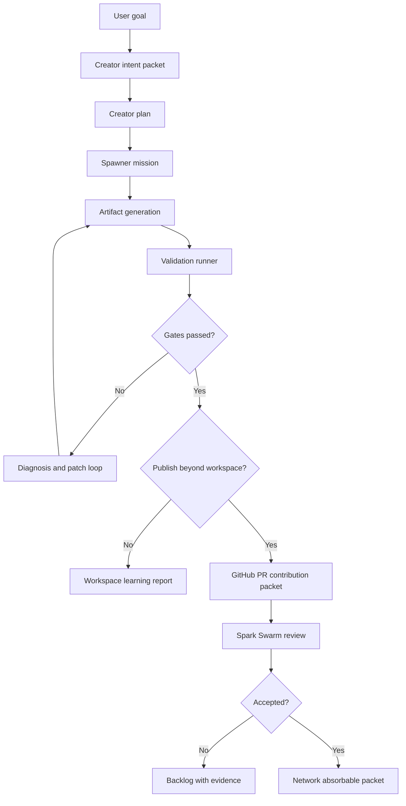

## 2. Repo ownership map

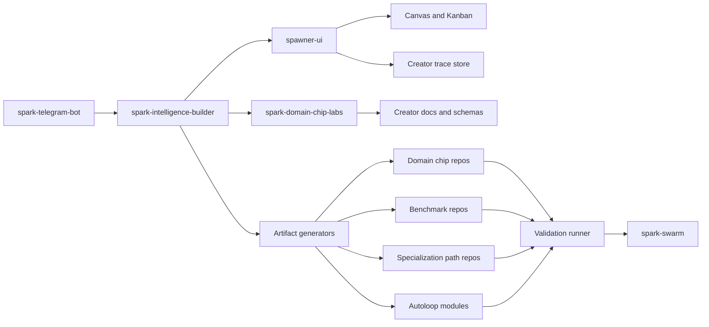

Ownership rule: Builder decides what should be built. Spawner coordinates how it runs. Domain repos own domain artifacts. Benchmark repos own scoring surfaces. Spark Swarm owns network absorption.

## 3. Telegram to mission-control flow

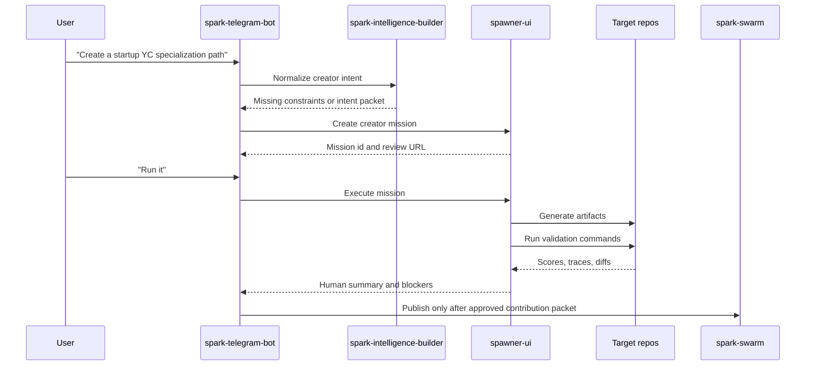

## 4. Creator mission state machine

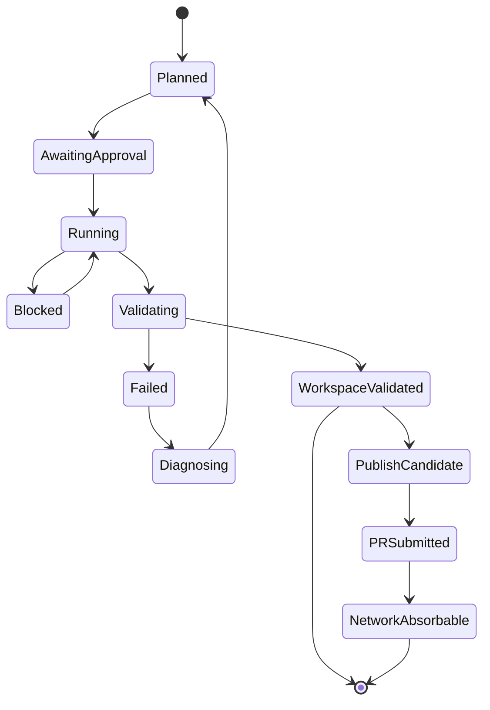

State labels matter because the UI should never collapse "generated", "validated", and "publishable" into one vague success state.

## 5. Artifact generation DAG

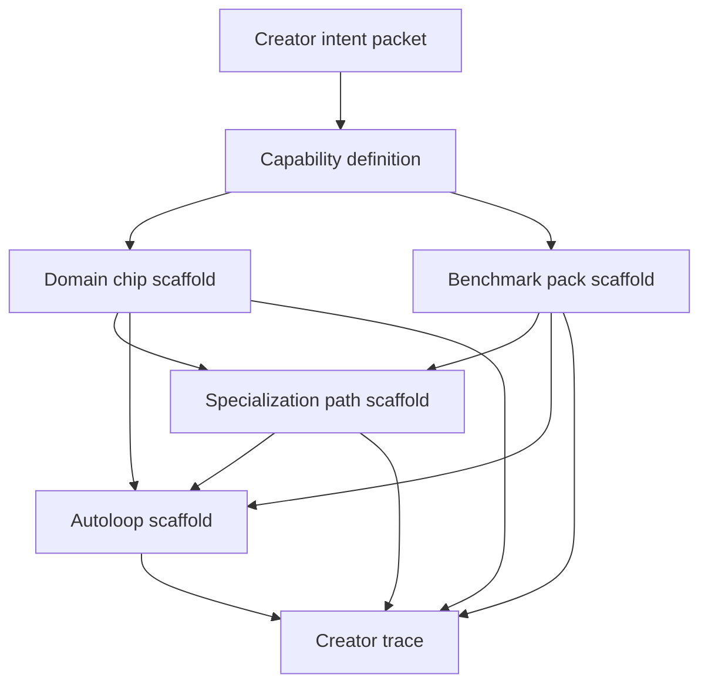

No autoloop should be generated before the benchmark pack and mutation boundaries exist.

## 6. Evidence ladder

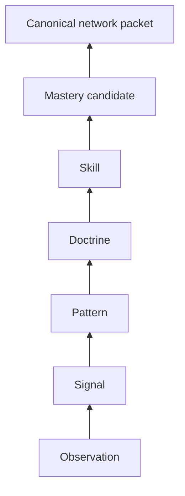

Promotion requirements:

| From | To | Required proof |
| --- | --- | --- |
| Observation | Signal | Repeat or score. |
| Signal | Pattern | Multiple cases, seeds, or tasks. |
| Pattern | Doctrine | Mechanism, boundary, counterexample. |
| Doctrine | Skill | Better behavior in benchmark or tool use. |
| Skill | Mastery candidate | Held-out, simulator, trap, or fresh-agent evidence. |
| Mastery candidate | Canonical | Review, replay command, rollback, trust-tier approval. |

## 7. Benchmark tiering

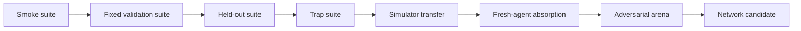

Use only the tiers needed for the claim:

- A syntax scaffold needs smoke tests.
- A domain chip needs fixed and trap validation.
- A specialization path needs absorption validation.
- A mastery claim needs held-out, simulator, trap, and absorption evidence.
- A Swarm canonical packet needs review and rollback.

## 8. Autoloop governance

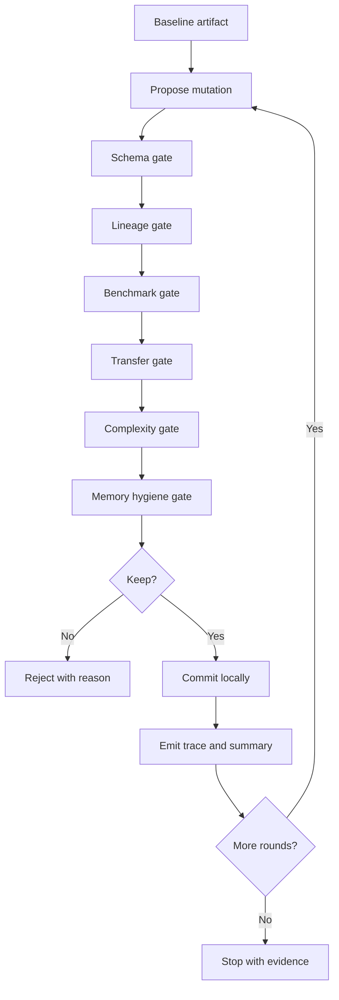

Autoloops are not score chasers. They are controlled experiments over declared mutation surfaces.

## 9. Workspace lane vs network lane

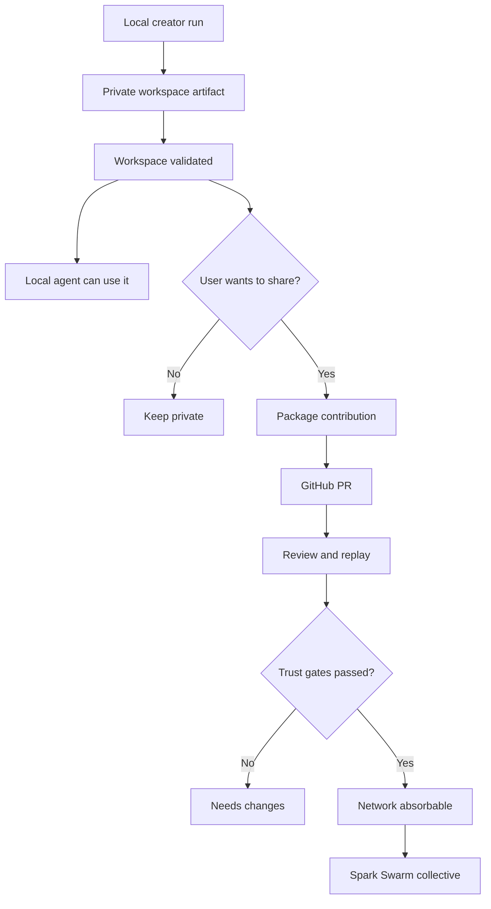

This is the answer to the security and speed tension: local CLI and workspace loops can be fast; network contribution must be structured and reviewed.

## 10. Startup YC golden reference flow

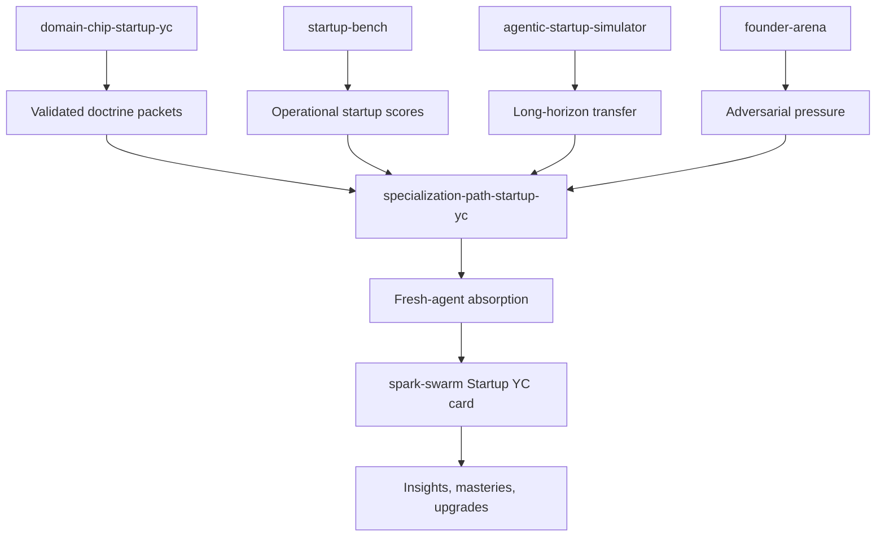

Current truth: Startup YC has promising validated-pack uplift and useful operational packets, but it still needs stronger trap, held-out, simulator, and arena validation before we should call it canonical mastery.

## 11. Creator validation sequence

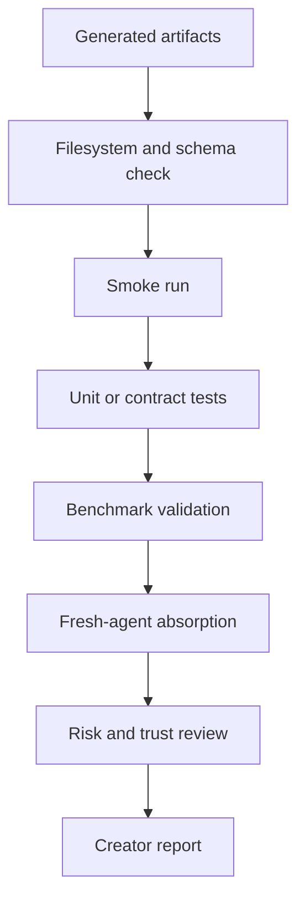

The report must include:

- What changed.
- What passed.
- What failed.
- What the agent can now do better.
- Where the result should not be trusted yet.
- Whether it is workspace-only or network-ready.

## 12. Future creator UI frame

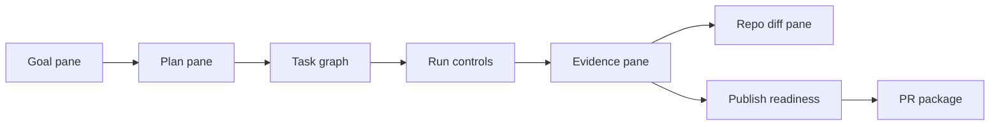

The UI should make high-quality work easier without making the evidence invisible.
