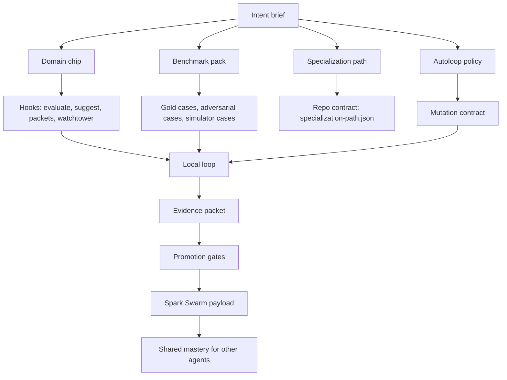

# Spark Creator System Master Plan

## Purpose

Spark should let users and their agents create deep domain intelligence systems from plain intent:

- a domain chip that makes an agent meaningfully better at a domain or tool
- a benchmark that can prove improvement without grading theater
- a specialization path that turns repeated practice into mastery
- an autoloop that mutates only safe, measurable surfaces
- a Spark Swarm connection that shares benchmark-backed insights with other agents
- a Telegram and mission-control flow that makes this trackable for normal users

The hard part is not scaffolding files. The hard part is making the created system improve honestly.

## North Star

For any user, use case, or tool, Spark should be able to create a repo-backed learning system with this shape:



If the loop cannot produce an evidence packet that survives validation, Spark should not claim mastery.

## Repository Roles

### spark-intelligence-builder

Builder is the runtime core. It should own:

- identity and session continuity
- provider/auth configuration
- domain chip attachment and activation
- specialization-path readiness
- Swarm operability checks
- stable CLI commands that Telegram and future clients can call

Builder should not own domain-specific chip logic, Telegram ingress, benchmark engines, or mission execution state.

### spark-telegram-bot

Telegram is the conversational gateway. It should own:

- the live Telegram bot token
- admin/user access checks
- `/chip create`, `/loop`, `/schedule`, `/run`, `/board`, `/mission`
- user-facing summaries of long-running creator work

Telegram should not become a second workflow database. It should call Builder or Spawner and report the trace.

### spawner-ui

Spawner UI is the execution plane and mission-control surface. It should own:

- PRD and plan generation from user goals
- mission execution
- Kanban state
- Canvas loading and task graph execution
- trace endpoints used by Telegram and agents

Spawner should not own domain chip secrets, Telegram bot tokens, or Swarm authority.

### spark-canvas and Kanban

Canvas and Kanban should be the visual mission map:

- show creator pipeline stages
- expose benchmark gates and blocked states
- show which repo/files were created
- show loop runs, candidates, score deltas, and promotion decisions

They should read mission state. They should not invent independent truth.

### spark-domain-chip-labs

Domain Chip Labs is the methodology incubator. It should own:

- chip quality rubrics
- benchmark methodology
- creator-system docs
- factory research
- cross-chip pattern mining
- graduation criteria

This repo is the right temporary home for creator methodology. Once the contracts stabilize, split the general docs into a dedicated `spark-creator` repo.

### Spark Swarm

Spark Swarm is the collective intelligence layer. It should own:

- ingestion of benchmark-backed insights
- mastery records
- upgrade suggestions
- evolution modes
- cross-agent sharing
- network trust boundaries

Spark Swarm should not accept raw local residue as intelligence. It should receive typed, evidence-laned packets.

## Creator Modules

### Domain Chip Creator

Creates a domain chip from an intent brief.

Required output:

- `spark-chip.json`
- hooks for `evaluate`, `suggest`, `packets`, `watchtower`
- router metadata with precise intent keywords
- smoke tests for hook invocation
- initial domain doctrine and source registry
- benchmark bridge stub
- loop metadata, but not the loop engine

Quality bar:

- the chip can make an agent better at a recognizable domain task
- the chip can refuse out-of-domain tasks
- the chip has a measurable score surface
- the chip emits packets with evidence lanes

### Specialization Path Creator

Creates the repo-backed progression surface for a domain.

Required output:

- `specialization-path.json`
- default scenario path
- default mutation target path
- `.spark-swarm/collective-sync.json` path
- benchmark scenario folders
- operator guide
- `AUTORESEARCH.md` path block
- README that tells an agent how to run one smoke loop

Quality bar:

- Builder, Telegram, and Swarm can resolve the same path without custom tribal knowledge
- the path has at least one benchmark-backed progression gate from day one
- the path knows what mastery means in that domain

### Benchmark Creator

Creates the truth surface.

Required output:

- benchmark manifest
- case set
- scoring rubric
- adversarial cases
- regression cases
- score report schema
- baseline result
- explanation of what the benchmark proves and does not prove

Quality bar:

- improvement on the benchmark corresponds to better real operator behavior
- the benchmark has anti-gaming tests
- scoring is deterministic where possible
- judge-based scoring is paired with calibration examples and disagreement checks

### Autoloop Creator

Creates the recursive loop policy and runner configuration.

Required output:

- mutation surface definition
- allowed files and forbidden files
- stop conditions
- rollback rule
- benchmark gate
- evidence packet schema
- promotion policy
- review mode

Quality bar:

- a loop can improve a meaningful target without widening its own authority
- failed or flat rounds produce useful diagnosis instead of fake wins
- every accepted mutation has lineage, score evidence, and a rollback condition

## Benchmark Families Spark Needs

Different domains need different benchmark styles. Benchmark Creator should support at least these:

| Benchmark family | Use case | Example |
| --- | --- | --- |
| Fixed-case rubric | Stable decision quality | Startup advice cases, prompt optimization cases |
| Simulator benchmark | Dynamic strategy under changing state | Founder Arena, genetic startup simulator, trading sims |
| Tool-operation benchmark | Can the agent use a tool correctly | Browser ops, Spawner missions, Telegram flows |
| Artifact-quality benchmark | Is the generated output good | landing pages, docs, code, decks |
| Retrieval/memory benchmark | Does the agent recall and apply durable knowledge | Builder memory and chip packets |
| Adversarial benchmark | Can the agent resist traps, vague asks, malicious inputs | prompt injection, bad startup advice, fake benchmark wins |
| Longitudinal benchmark | Does the agent improve across sessions | specialization path mastery |
| Collective benchmark | Does shared Swarm intelligence improve another agent | cross-agent replay after insight sync |

No single benchmark family is enough for mastery.

## Mastery Definition

A Spark specialization should not call itself mastered because a loop ran or a score moved once.

Mastery requires:

1. baseline performance
2. benchmark-backed improvement
3. repeated or cross-case improvement
4. adversarial resistance
5. transfer to a different but related task
6. usable guidance emitted as packets
7. Swarm-readable lineage

The minimum promotion packet should include:

```json
{
  "domain": "startup-yc",
  "claim": "Risk sequencing improves founder decision quality under default-dead pressure.",
  "mechanism": "Force runway, retention, and customer pain before acquisition expansion.",
  "benchmark_result": {
    "benchmark_id": "startup-bench.v1",
    "baseline_score": 0.61,
    "candidate_score": 0.67,
    "delta": 0.06,
    "replications": 3
  },
  "boundaries": [
    "Not a fundraising-stage selector.",
    "Does not replace customer interviews."
  ],
  "anti_gaming_checks": [
    "held_out_cases_passed",
    "no_score_format_inflation"
  ],
  "promotion_recommendation": "benchmark_supported"
}
```

## Phased Build Plan

### Phase 1: Canonical creator docs

Status: started in this folder.

Build:

- master plan
- agent playbook
- benchmark and autoloop protocol
- Telegram/Builder/Spawner flow

Exit criteria:

- an agent can read the docs and correctly describe which repo owns which responsibility
- no creator module is allowed to claim mastery without benchmark evidence

### Phase 2: Creator packet schema

Status: initial schema anchors added in `docs/creator_system/schemas/`.

Build one shared creator request/response schema:

- `creator_intent_packet`
- `created_artifact_manifest`
- `benchmark_pack_manifest`
- `loop_policy_manifest`
- `swarm_promotion_packet`

Exit criteria:

- Telegram, Builder, and Spawner can all pass the same packet shape around.
- Product surfaces still defer evidence truth to `creator-run-smoke` and `creator-run-doctor`.

### Phase 3: Golden Startup YC reference

Use Startup YC as the canonical reference implementation.

Build:

- one domain chip reference
- one specialization path reference
- one Startup Bench bridge
- one Founder Arena or startup simulator bridge
- one autoloop policy
- one Swarm promotion packet

Exit criteria:

- a fresh agent can reproduce the Startup YC loop from the docs

### Phase 4: Generator acceptance tests

Every creator must be benchmarked.

Initial multi-family executable proof now exists in
`src/chip_labs/creator_generator.py` and
`tests/test_creator_generator_acceptance.py`. It runs in temporary clean
workspaces and proves the local creator-run contract can be generated from fresh
briefs through `candidate_review` with recomputable provenance.

Current proof domains:

- artifact quality for design docs and PR writeups
- tool operation for safe local creator-run CLI use
- MiroFish-style content simulation with persona batches and multi-RLM judges
- Spark doctor adversarial/security repair checks
- Startup YC operator advice

Build out acceptance tests such as:

- add retrieval/memory proof when the memory system is ready
- add deeper real adapters for the current proof domains
- add transfer probes after local candidate review is stable
- add human/operator calibration fixtures

Still deferred:

- Telegram mission traces
- Spawner, Canvas, and Kanban creator surfaces
- network absorption claims

Exit criteria:

- creator output quality is measured, not trusted

### Phase 5: Product flow

Expose creation from:

- Telegram conversation
- Builder CLI
- Spawner mission
- Canvas/Kanban mission control

Current bridge:

- `creator-mission-status` is the canonical read-only packet for product
  surfaces.
- Builder, Telegram, Spawner, and Canvas consumer branches exist and are
  recorded in `PRODUCT_SURFACE_CONSUMER_BRANCHES_2026-05-01.md`.
- Product surfaces may render status, blockers, next actions, and publication
  boundaries, but they must not invent verdicts or upgrade evidence tiers.
- Runtime creation controls, Spawner execution, Canvas editing, and Kanban
  mutation remain deferred to product repos.

Exit criteria:

- a user can ask for a domain chip or specialization path in normal language
- Spark turns it into a trackable mission
- the final output includes repo path, tests, benchmark result, and Swarm readiness

CI guardrail:

- `.github/workflows/creator-system.yml` runs the focused creator-system lint,
  proof-domain tests, strict Startup YC smoke, and template check for relevant
  changes.

## Non-Negotiable Guardrails

- No raw secrets in prompts, docs, screenshots, or committed files.
- No benchmark score claim without a reproducible score report.
- No Swarm promotion from operational residue.
- No autoloop mutation outside the declared mutation surface.
- No generic router keywords that hijack unrelated user messages.
- No hidden fallback repo when an attached specialization repo exists.
- No "mastery" label without transfer or repeat evidence.
