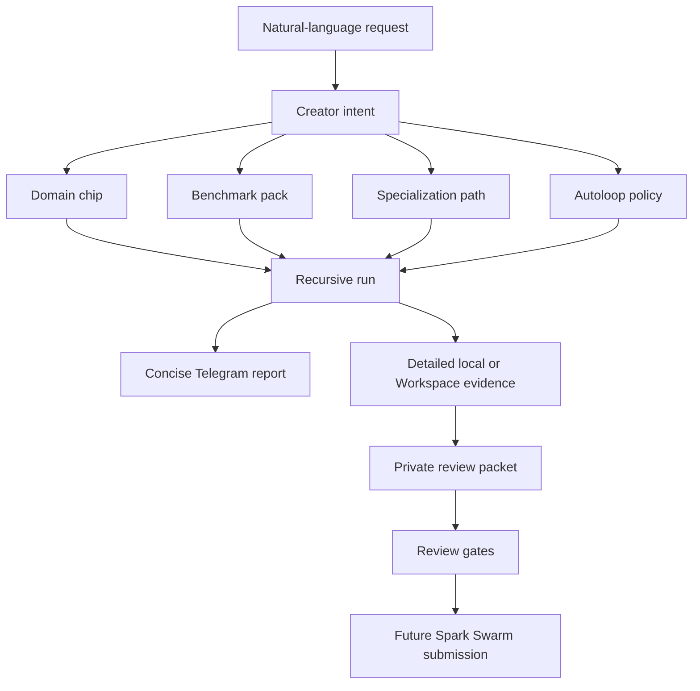

# Natural-Language Recursive Loop Guide

This guide explains how a person should be able to ask Spark, in normal language, to create and improve a specialist agent system.

The target experience is simple:

```text
make a QA tester for my Spark systems
make it better at Telegram and Workspace reports
run it
show me what improved
prepare it for Spark Swarm review
```

Spark should translate that conversation into a standardized creator run:

- a domain chip,
- a benchmark pack,
- a specialization path,
- an autoloop policy,
- recursive improvement runs,
- concise Telegram reports,
- detailed Workspace evidence,
- and a private review packet that can later be considered for Spark Swarm.

Spark Swarm Workspace and public network absorption are not public dependencies yet. This guide prepares compatible local and private artifacts without telling users to install or publish through Spark Swarm.

## The Promise

When someone uses Spark, they should be able to keep upgrading their agent for the work they actually do.

That means Spark should not only answer questions. It should learn the shape of a job, build benchmarks for that job, practice against those benchmarks, improve its tools and policies, and show the operator what changed in a way they can understand.

Good recursive loops make Spark better at:

- making decisions in a domain,
- using tools safely,
- creating new tools,
- communicating results clearly,
- recovering from failed runs,
- keeping local/private work separate from public/network-ready work,
- and sharing only benchmark-backed lessons when network sharing is available.

## The Golden Conversation

The public experience should prefer plain requests over long commands.

| What the user says | What Spark should infer |
| --- | --- |
| `make a QA tester for Spark` | Create or update the `spark-qa-operator` specialization lane. |
| `make it better at Telegram reports` | Add a Telegram-report benchmark lane under the QA operator. |
| `make it better at Workspace sync` | Add Workspace sync and evidence-quality cases under the same QA operator. |
| `run it` | Start the planned creator mission or recursive loop. |
| `status` | Return the current mission or loop state in a compact message. |
| `show me what improved` | Return the latest score, verdict, blockers, and Workspace link. |
| `prepare it for review` | Build a private review packet; do not publish to the network. |
| `what should we fix next?` | Diagnose weakest benchmark lane, blocked gate, or missing evidence. |

Slash commands can remain as precise operator controls, but regular users should be able to complete the main path through conversation.

## Telegram Phrases Available Now

The current Spark AGI Telegram runtime can already route these normal phrases:

| User says | Spark does |
| --- | --- |
| `make the QA tester better by creating better benchmarks and autoloops for Spark Telegram and Workspace` | Plans a Spark QA Operator creator mission. |
| `run it` | Runs the planned creator mission. |
| `status` | Shows the planned/running creator mission state. |
| `validate it` | Runs creator validation checks. |
| `show me the QA tester report` | Shows `path:spark-qa-operator` recursive report. |
| `trace the QA operator loop` | Shows the QA Operator recursive trace. |
| `start one QA improvement loop` | Starts one recursive QA Operator round. |
| `run the QA operator for 3 rounds` | Starts three QA Operator recursive rounds. |
| `what QA decisions need review?` | Opens QA Operator review decisions. |
| `show recursive loops` | Lists recursive loops. |
| `show recursive paths` | Lists recursive lanes. |

The internal commands still exist, but they are now implementation details for these paths.

## Conversational Style and Context

Natural language support should feel like a conversation, not a hidden slash-command quiz. Spark should understand both direct requests and contextual follow-ups when the active loop is clear from recent chat.

Direct target examples:

| User says | Spark does |
| --- | --- |
| `show me the QA tester report` | Reports on `path:spark-qa-operator`. |
| `trace Startup YC` | Shows the Startup YC trace. |
| `run the QA operator for 3 rounds` | Starts three QA Operator rounds. |

Contextual follow-up examples after the chat has been about Spark QA Operator:

| User says | Spark does |
| --- | --- |
| `give me the readout` | Reports on the active QA Operator path. |
| `where did we land?` | Reports on the active QA Operator path. |
| `show the receipts` | Shows the trace and evidence trail. |
| `show me proof` | Shows the trace and evidence trail. |
| `what needs my call?` | Shows review decisions. |
| `do I need to approve anything?` | Shows review decisions. |
| `run another round` | Starts one more recursive round. |
| `give it another pass` | Starts one more recursive round. |
| `keep going` | Continues the current loop for one safe round. |

The resolver should stay conservative: context may choose the active loop, but it must not invent a target, publish a packet, or claim improvement without benchmark evidence. If the active loop is unclear, Spark should ask for the lane or show `/recursive sessions`.

## What Spark Builds



Each artifact has one job:

| Artifact | Plain meaning |
| --- | --- |
| Domain chip | The specialist's doctrine: what good work looks like, common traps, and useful hooks. |
| Benchmark pack | The scoreable tests that prove whether the specialist is actually getting better. |
| Specialization path | The long-running improvement lane for this capability. |
| Autoloop policy | What Spark is allowed to mutate, when to stop, when to keep, and how to roll back. |
| Recursive run | One or more improvement attempts against the benchmark. |
| Telegram report | The short human-readable update. |
| Workspace evidence | The detailed trace, artifacts, scorecards, and review state. |
| Review packet | A local/private bundle that can later be reviewed for network sharing. |

## The First Reference Loop: Spark QA Operator

`spark-qa-operator` is the first flagship example because it improves Spark itself.

The parent lane is:

```text
spark-qa-operator
```

Product surfaces are benchmark lanes under that parent, not separate root domains:

- Telegram replies,
- recursive reports,
- Workspace evidence,
- Spawner creator missions,
- Canvas and Kanban readability,
- auth pairing,
- tool-operation safety,
- local/private review packets.

This matters because a request like:

```text
make the QA tester better by creating better benchmarks and autoloops for Spark Telegram and Workspace
```

should improve the QA tester, not accidentally create a standalone `spark-telegram` specialization path unless the operator explicitly asks for that.

## Socratic Questions Spark Should Ask Itself

Before planning a loop:

1. What is the actual capability the user wants improved?
2. Is this a new root domain, or a benchmark lane inside an existing specialist?
3. What would count as real improvement, not nicer wording?
4. What should stay local/private?
5. What evidence would another agent need to trust this result later?

Before running an autoloop:

1. Is there a baseline score?
2. Are there held-out or trap cases?
3. Is the mutation surface narrow enough?
4. Is rollback clear?
5. Could this loop create a fake improvement by changing the benchmark, prompt wording, or reporting format?

Before reporting:

1. What is the one thing the user needs to know right now?
2. Did the score improve, regress, or hold steady?
3. What is blocked?
4. Where does the detailed evidence live?
5. What is the safest next action?

Before preparing a review packet:

1. Is the packet private, reviewed, or network absorbable?
2. Are secrets, paths, tokens, transcripts, and private evidence excluded?
3. Does the evidence tier match the weakest passing gate?
4. Is the rollback or deprecation policy explicit?
5. Would a fresh Spark agent know how to reuse the lesson?

## Telegram Message Contract

Telegram should answer the operator, not dump the database.

Good Telegram reports are short:

```text
Latest QA run held steady.

Score
- overall 0.834
- current best for this path

Workspace
- 20 saved items
- http://127.0.0.1:5173/runs?tab=recursions
```

Telegram should show:

- verdict,
- score or round count,
- review blocker if one exists,
- one Workspace link,
- one useful next action when needed.

Telegram should not show:

- raw tokens,
- long command lines,
- full traces,
- repeated score explanations,
- every artifact path,
- or network-publication claims that have not passed gates.

Workspace or local reports should hold the detailed material:

- traces,
- candidate diffs,
- benchmark manifests,
- baseline and candidate scorecards,
- kept/reverted reasons,
- review decisions,
- packet readiness,
- privacy and rollback notes.

## Local, Private, And Future Public States

Every generated system should show its sharing state plainly.

| State | Meaning | User-facing copy |
| --- | --- | --- |
| Local | Only exists on this machine or repo. | `saved locally` |
| Private workspace | Synced to the user's private Workspace. | `private for now` |
| Review candidate | Has enough evidence to review. | `ready for review` |
| Reviewed candidate | Accepted by maintainers or admins for a specific boundary. | `reviewed candidate` |
| Network absorbable | Safe for broader Spark Swarm absorption. | `available to the network` |

Until Spark Swarm public workspace is open, generated systems should default to local/private and use future-compatible packets.

## Evidence Gates

Spark should never say a loop improved just because the language became smoother.

Use the existing creator-system gates:

- schema gate: artifacts match the expected shape,
- lineage gate: the mutation addresses a concrete weak track or failure,
- benchmark gate: candidate beats baseline,
- held-out gate: fresh or held-out cases do not regress,
- trap gate: adversarial and no-op cases stay safe,
- complexity gate: complexity does not rise without measured gain,
- memory hygiene gate: operational residue is not promoted as doctrine,
- review gate: private/public boundary is explicit.

Flat and reverted rounds are allowed outcomes. They are often the system doing the right thing.

## Weekly Loop Portfolio

A strong public story should come from several real loops, not one demo.

Recommended sequence:

1. Spark QA Operator: improve Spark's own Telegram, Workspace, and creator-run quality.
2. AI Security Questionnaires: prove tool-assisted enterprise response quality.
3. Startup YC: continue benchmark-backed founder/operator judgment.
4. Prompt Engineer: improve prompts against held-out task suites.
5. Content/X Operator: improve post-quality decisions with outcome-aware scoring.
6. Researcher: improve source quality, synthesis, and citation discipline.
7. Tool Operator: improve safe repo/tool execution and recovery behavior.

Each loop should improve one reusable part of the system:

- standardization,
- natural-language invocation,
- Telegram report composition,
- dashboard readability,
- benchmark design,
- autoloop policy,
- review packet quality,
- public/private boundary handling.

## What Makes This A Moat

The moat is not that Spark has one large prompt.

The moat is that Spark can create specialist systems with:

- standard artifact contracts,
- benchmark-backed improvement,
- local/private workspaces,
- future network sharing,
- repeatable review gates,
- concise human communication,
- and reusable lessons that other Spark agents can absorb safely.

As more users create chips, paths, benchmarks, and packets, Spark can become better at many specialized workflows without pretending every local experiment is universal truth.

## Implementation Checklist

For each new natural-language loop:

- Identify the parent lane.
- Decide whether the request creates a new domain or a benchmark lane under an existing domain.
- Create or update the domain chip.
- Create visible, held-out, trap, and no-op benchmark cases.
- Create an autoloop policy with mutation, keep, stop, and rollback rules.
- Run a baseline before mutation.
- Run at least one candidate round.
- Report compactly in Telegram.
- Save detailed evidence locally or in Workspace.
- Prepare a private review packet only after benchmark evidence exists.
- Keep Spark Swarm network publication disabled until gates explicitly pass.

## Done Means

A self-improving loop is usable when a non-technical person can:

1. ask for the specialist in normal language,
2. understand what Spark is going to build,
3. say `run it`,
4. see whether it improved,
5. open the detailed evidence if they care,
6. know whether it is private, reviewable, or shareable,
7. and run the next improvement round without learning internal command syntax.
