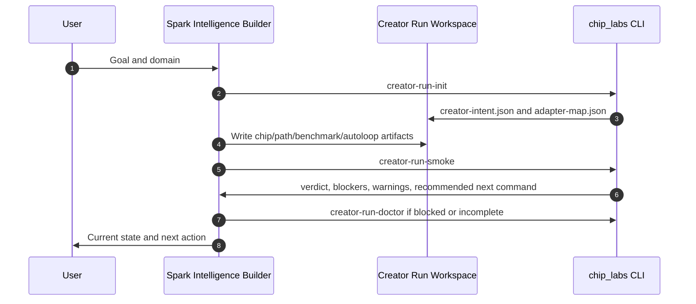
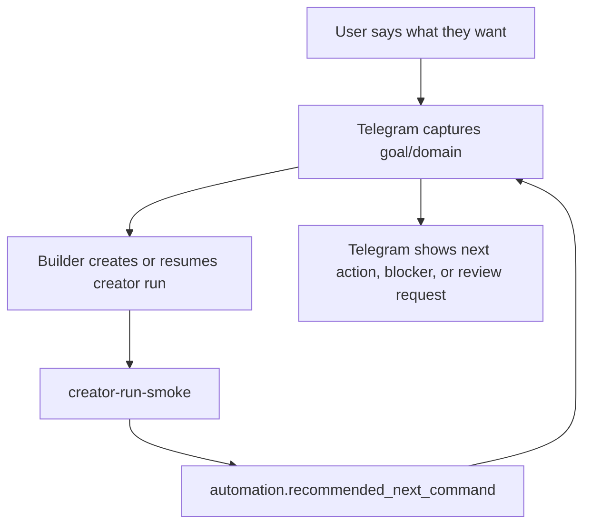

# Phase 2 Product Flow Backlog

This document preserves the intended product wiring for the creator system without treating it as shipped.

Phase 2 should start only after Builder, memory, conversations, Telegram interactions, Spawner UI, Canvas, and Kanban are polished enough that the creator system can be surfaced cleanly instead of becoming another confusing control plane.

## Status

Deferred.

The current V1 contract is CLI and repo based:

- `creator-run-init`
- `creator-run-template-check`
- `creator-run-smoke`
- `creator-run-doctor`
- creator-run artifacts and schemas
- Startup YC reference fixture

Product surfaces may reference these commands as future integration points, but they should not expose a finalized creator workflow yet.

## Builder Integration Contract

Spark Intelligence Builder should eventually own artifact generation and execution.

Expected flow:

Builder should read:

- `automation.blocked`
- `automation.ci_exit_code`
- `automation.recommended_next_command`
- `blocking_checks`
- `warning_checks`
- `missing_paths`
- `evidence_tier`
- `verdict`

Builder should not publish or sync to Swarm when `automation.blocked` is true.

## Telegram Flow

Telegram should be an intent and status surface, not the system that invents benchmark logic.

Expected flow:

Telegram should show the next action in plain language:

- what Spark is building,
- what has passed,
- what is blocked,
- what needs user approval,
- whether publication is local-only, GitHub PR, or Swarm-shared.

Telegram should not ask users to paste low-level access tokens as a normal workflow. Auth should be handled by durable, scoped connection flows.

## Spawner UI, Canvas, And Kanban Mapping

This mapping is future-facing only.

Creator-run verdicts should map to mission columns:

| Creator verdict | Future column | Meaning |
| --- | --- | --- |
| `prototype` | `prototype` | Intent and adapters exist; core artifacts need to be built. |
| `ready_for_baseline` | `ready_for_baseline` | Core artifacts exist; benchmark and absorption evidence need to run. |
| `ready_for_swarm_packet` | `ready_for_swarm_packet` | Evidence and packet exist; review publication boundary. |
| `blocked` | `blocked` | Required schema, field, evidence, or claim support failed. |

Canvas should eventually show the artifact graph:

- creator intent,
- adapter map,
- domain chip,
- specialization path,
- benchmark pack,
- autoloop policy,
- absorption report,
- Swarm packet,
- GitHub PR or local repo state.

Kanban should show work state, not duplicate benchmark logic. It should render the verdict and check names produced by `creator-run-smoke`.

## Phase 2 Acceptance Criteria

Phase 2 is ready only when:

1. Builder can create a creator run, write artifacts, run smoke, and report blockers without manual file surgery.
2. Telegram can collect goal/domain and show `automation.recommended_next_command` without exposing raw system internals.
3. Spawner UI can display creator missions without crowding existing mission-control workflows.
4. Canvas/Kanban can render artifact and verdict state from the same trace object.
5. Publication mode is explicit: `local_only`, `github_pr`, or `swarm_shared`.
6. Smoke and doctor outputs remain the source of truth for blockers, warnings, and next actions.

## Non-Goals For Current V1

- Do not finalize Spawner UI mission columns yet.
- Do not require Canvas/Kanban for creator runs.
- Do not route normal users through access-token paste flows.
- Do not let Telegram or UI code redefine benchmark scores.
- Do not let a product surface publish broad mastery when smoke warns about broad transfer.

