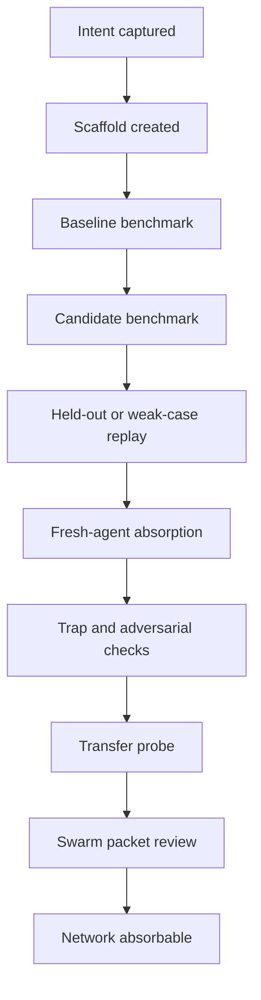

# Promotion Gates And Evidence Tiers

## Purpose

This contract defines when a Spark-created domain chip, benchmark, specialization path, autoloop, or Swarm packet is allowed to claim improvement.

The central rule:

> A creator run can only claim the tier that its weakest validated evidence supports.

If the benchmark improves but absorption fails, the run is benchmark-supported only. If focused transfer works but broad transfer fails, the run is transfer-supported only inside the tested boundary. If a loop changes the standard itself, it needs standard-update evidence, not normal domain evidence.

## Evidence Tiers

| Tier | Meaning | Network publication |
| --- | --- | --- |
| `prototype` | Intent, adapter map, and scaffold exist. No benchmark claim yet. | No |
| `benchmark_signal` | One reproducible benchmark result improved. Useful local signal. | No, unless clearly labeled local evidence |
| `focused_pattern` | Repeated or held-out cases support the same focused mechanism. | Review only |
| `candidate_review` | Candidate beats baseline, absorption improves, traps are covered, and Swarm packet is internally consistent. | Human review required |
| `transfer_supported` | Candidate also transfers to a simulator, arena, tool benchmark, or adjacent scenario family. | Allowed with boundary |
| `network_absorbable` | Broad transfer is positive and provenance, rollback, privacy, and trap checks pass. | Allowed |
| `standard_update` | The creator methodology itself should change based on repeated failures or a severe blocker. | Maintainer approval required |

## Promotion Ladder



Each arrow must preserve lineage. A later score cannot erase an earlier failed gate; it must either fix the failure or explicitly narrow the claim.

## Gate Requirements

### Prototype Gate

Required:

- `creator-intent.json`
- `adapter-map.json`
- declared privacy boundary
- declared minimum evidence tier
- selected domain, benchmark, tool, autoloop, absorption, and Swarm adapters

Allowed claim:

```text
This creator run is scaffolded and ready to build artifacts.
```

Forbidden claim:

```text
This domain chip improves agent performance.
```

### Benchmark Signal Gate

Required:

- benchmark manifest
- scoring rubric
- baseline result
- candidate result
- positive candidate delta
- no known trap regressions

Allowed claim:

```text
The candidate improved one reproducible benchmark by +X under the stated setup.
```

Forbidden claim:

```text
The agent mastered the domain.
```

### Focused Pattern Gate

Required:

- repeated benchmark result or held-out/fresh case result
- weakest-track diagnosis
- mechanism that explains the improvement
- claim boundary
- rollback condition

Allowed claim:

```text
This mechanism appears useful for this focused capability and case family.
```

Forbidden claim:

```text
This mechanism is generally reliable across the domain.
```

### Candidate Review Gate

Required:

- positive candidate delta
- candidate score beats baseline score
- absorption report has all modes present and scored
- validated-pack absorption delta is positive
- trap-band case count is positive
- Swarm packet tier and delta match reports
- source commit provenance
- rollback or deprecation rule

Allowed claim:

```text
This packet is ready for human review as a candidate contribution.
```

Forbidden claim:

```text
Other agents should absorb this automatically.
```

### Transfer Supported Gate

Required:

- all Candidate Review requirements
- transfer report from a simulator, arena, adjacent benchmark, or real tool-operation run
- positive transfer delta
- constraints passed
- Swarm packet includes matching `simulator_or_arena_result`

Allowed claim:

```text
This packet transferred positively to the named transfer surface.
```

Forbidden claim:

```text
This packet is broadly true across all related domains.
```

### Network Absorbable Gate

Required:

- all Transfer Supported requirements
- positive broad transfer probe when broad absorption is claimed
- privacy boundary allows network publication
- rollback/deprecation rule is actionable
- known limits are explicit
- no unresolved contradiction or trap failure

Allowed claim:

```text
This packet is safe for network absorption inside its documented boundary.
```

Forbidden claim:

```text
This packet should replace local judgment or future benchmark checks.
```

### Standard Update Gate

Required:

- concrete creator-loop failure or severe blocker
- causal explanation
- at least three prior failures, or one severe failure
- complexity delta
- transfer check across at least one other domain or tool type
- rollback owner and window
- maintainer review

Allowed claim:

```text
The creator standard should change in this specific way because repeated evidence shows the current standard fails here.
```

Forbidden claim:

```text
This sounds like a better process, so make it the new standard.
```

## Claim Boundary Rules

Every promoted packet must answer:

1. What changed?
2. What capability should improve?
3. Which benchmark or simulator proved it?
4. What was the baseline?
5. What was the candidate result?
6. What failed before the patch?
7. What remains unproven?
8. Who or what can safely use it?
9. How is it rolled back or deprecated?

If any answer is missing, the packet can still be useful locally, but it is not network absorbable.

## Product Surface Promotion Boundary

`creator-mission-status` may be consumed by Builder, Telegram, Spawner, Canvas,
and Kanban as a read-only status packet. Product surfaces can show verdicts,
evidence mode, blocking checks, missing gates, next actions, and publication
boundaries, but they cannot upgrade an evidence tier or treat saved evidence as
fresh recompute evidence.

A product view that renders `ready_for_swarm_packet` must still preserve the
separate publication claim. In particular, `ready_for_swarm_packet` and
`transfer_supported` do not imply `network_absorbable`; network absorption still
requires multi-seed validation, human/operator calibration, privacy review,
rollback review, and publication approval.

## Startup YC Reference

The Startup YC seeded-variance run is the current reference pattern.

Useful evidence:

- First full suite found People losses: `28/30` wins, `2` losses, min delta `-0.0047`.
- The weakness was concrete: manager ownership and capacity repair were too weak under `manager_bench_fragility`.
- The People adapter was patched without weakening the benchmark.
- Focused People rerun passed: `5/5` wins, mean delta `+0.0242`.
- Final six-track suite passed: `30/30` wins, mean delta `+0.0561`, min delta `+0.0106`.

Promotion-safe claim:

```text
Startup YC adapters won 30/30 scenario-seed runs across the first 6-track seeded-variance suite, with real seed variants firing across GTM, Finance, Product, People, Board, and Scale and mean scenario delta +0.0561.
```

Promotion-unsafe claim:

```text
Startup YC is fully mastered across all startup work.
```

## Anti-Overbuild Rule

Do not add new creator machinery unless it satisfies at least one of these:

- catches a failure that current gates miss,
- reduces manual judgment without lowering evidence quality,
- makes transfer safer or more measurable,
- makes a future agent less likely to overclaim,
- removes a repeated source of broken runs.

Documentation is enough when the missing piece is judgment. Code is needed only when repeated runs need enforcement.
