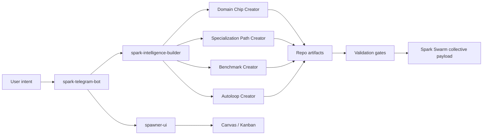

# Spark Creator System

This folder is the agent-readable methodology hub for creating Spark domain chips, benchmarks, specialization paths, autoloops, and Swarm-publishable mastery loops.

The goal is not to make one large creator repo do everything. The goal is to give Spark agents a stable set of contracts so a user can say what they want from Telegram, Builder, Spawner UI, Canvas, or a local repo, and Spark can produce a high-quality, benchmarked, Swarm-compatible system without guessing.

## Documents

| Document | Purpose |
| --- | --- |
| [CREATOR_SYSTEM_COMMUNITY_HANDOFF_2026-05-01.md](CREATOR_SYSTEM_COMMUNITY_HANDOFF_2026-05-01.md) | Current comprehensive handoff: completed work, diagrams, connection systems, planning status, gaps, and community publishing path. |
| [CREATOR_SYSTEM_PRD_V1.md](CREATOR_SYSTEM_PRD_V1.md) | Comprehensive PRD for the creator system, including users, artifact contracts, benchmark architecture, trust lanes, requirements, and phased roadmap. |
| [USER_QUICKSTART_BETA.md](USER_QUICKSTART_BETA.md) | Technical beta quickstart for installing the repo, creating a creator run, running smoke/doctor, proving the generator matrix, and reading evidence tiers. |
| [RELEASE_READINESS_CHECKLIST_BETA.md](RELEASE_READINESS_CHECKLIST_BETA.md) | Release checklist for fresh-clone install, command verification, claim boundaries, docs, and pre-release gates. |
| [CREATOR_SYSTEM_FLOWCHARTS.md](CREATOR_SYSTEM_FLOWCHARTS.md) | Mermaid diagram source for lifecycle, repo ownership, evidence ladder, benchmark tiers, autoloop gates, and Startup YC reference flow. |
| [CREATOR_SYSTEM_RESEARCH_LEDGER.md](CREATOR_SYSTEM_RESEARCH_LEDGER.md) | Practical research ledger from Startup YC, Startup Bench, agentic simulator, Founder Arena, Builder, Spawner, Telegram, and Spark Swarm. |
| [ADAPTIVE_CREATOR_LOOP_STANDARD.md](ADAPTIVE_CREATOR_LOOP_STANDARD.md) | The adaptive loop standard: domain-specific adapters, reusable evidence gates, recursive standard evolution, and the first runnable creator-run contract. |
| [CREATOR_SYSTEM_MASTER_PLAN.md](CREATOR_SYSTEM_MASTER_PLAN.md) | Cohesive product and architecture plan for the creator ecosystem. |
| [CREATOR_SYSTEM_PROOF_DOMAINS.md](CREATOR_SYSTEM_PROOF_DOMAINS.md) | Multi-domain proof layers for artifact quality, tool operation, content simulation, doctor security, Startup YC, and future memory/retrieval examples. |
| [CREATOR_SYSTEM_MULTI_DOMAIN_VALIDATION_PLAN.md](CREATOR_SYSTEM_MULTI_DOMAIN_VALIDATION_PLAN.md) | Long-running validation matrix for generated creator systems across artifact quality, tool operation, MiroFish content simulation, doctor/security, Startup YC operator, and retrieval/memory domains. |
| [BENCHMARK_GENERATION_HONESTY_STANDARD.md](BENCHMARK_GENERATION_HONESTY_STANDARD.md) | Minimum honesty contract for generated benchmark packs: case oracles, lane results, anti-gaming checks, provenance hashes, and Swarm claim boundaries. |
| [STARTUP_YC_EXTERNAL_RECOMPUTE_ADAPTERS.md](STARTUP_YC_EXTERNAL_RECOMPUTE_ADAPTERS.md) | External rerun adapter contract for Startup Bench, specialization-path absorption, broad transfer, Startup YC Swarm packet comparison, and provenance packets. |
| [SPARK_CREATOR_PUBLIC_REPO_DECISION.md](SPARK_CREATOR_PUBLIC_REPO_DECISION.md) | Decision note deferring public `spark-creator` extraction until schemas, provenance, transfer evidence, and product read-only contracts stabilize. |
| [CREATOR_SYSTEM_RELEASE_NOTES_2026-05-01.md](CREATOR_SYSTEM_RELEASE_NOTES_2026-05-01.md) | Release-note summary for the current creator-system standardization continuation. |
| [CREATOR_RUN_PRODUCTION_READINESS_V1.md](CREATOR_RUN_PRODUCTION_READINESS_V1.md) | Shippable creator-run CLI contract, smoke-result schema, integration rules, and V1 ship gate. |
| [CREATOR_RUN_GOLDEN_PATH_V1.md](CREATOR_RUN_GOLDEN_PATH_V1.md) | CLI-first golden path from user goal to creator-run validation, doctor repair plan, and strict publication check. |
| [PROMOTION_GATES_AND_EVIDENCE_TIERS.md](PROMOTION_GATES_AND_EVIDENCE_TIERS.md) | Canonical evidence-tier ladder, promotion gates, claim boundaries, and Startup YC seeded-variance reference pattern. |
| [PRODUCT_SURFACE_READ_ONLY_ADAPTERS.md](PRODUCT_SURFACE_READ_ONLY_ADAPTERS.md) | Phase 7 read-only adapter contract for Builder, Telegram, Spawner, Canvas, and Kanban. |
| [PRODUCT_SURFACE_CONSUMER_BRANCHES_2026-05-01.md](PRODUCT_SURFACE_CONSUMER_BRANCHES_2026-05-01.md) | Product-side read-only consumer branches and verification commands. |
| [PHASE_2_PRODUCT_FLOW_BACKLOG.md](PHASE_2_PRODUCT_FLOW_BACKLOG.md) | Deferred Builder, Telegram, Spawner UI, Canvas, and Kanban integration contract for when product surfaces are ready. |
| [AGENT_CREATOR_PLAYBOOK.md](AGENT_CREATOR_PLAYBOOK.md) | Step-by-step operating procedure for a Spark agent creating a new chip/path/benchmark/loop. |
| [BENCHMARK_AND_AUTOLOOP_PROTOCOL.md](BENCHMARK_AND_AUTOLOOP_PROTOCOL.md) | Benchmark types, scoring reliability rules, and autoloop promotion gates. |
| [TELEGRAM_BUILDER_SPAWNER_CREATOR_FLOW.md](TELEGRAM_BUILDER_SPAWNER_CREATOR_FLOW.md) | How Telegram, Spark Intelligence Builder, Spawner UI, Canvas, Kanban, and Spark Swarm should work together. |
| [schemas/](schemas/) | JSON Schema anchors for creator intent, adapter map, smoke, doctor, template-check, Swarm packet, mission-status, generated multi-seed summaries, and Startup YC validation plan, evidence, shape-check, gate-check, and suite outputs. |
| [templates/creator-run/](templates/creator-run/) | Fill-in templates for intent packets, adapter maps, creator run reports, Swarm packets, and standard-change proposals. |
| [examples/generated-multi-domain-briefs.json](examples/generated-multi-domain-briefs.json) | Manual CI input for the generated multi-domain, multi-seed matrix across artifact quality, tool operation, MiroFish content simulation, doctor/security, Startup YC operator, and retrieval/memory. |
| [examples/startup-yc-creator-run/](examples/startup-yc-creator-run/) | Real Startup YC fixture that maps the existing domain chip, specialization path, benchmark, autoloop, absorption reports, and Swarm packet into the creator-run contract. |
| [examples/startup-yc-operator-validation/](examples/startup-yc-operator-validation/) | Startup YC held-out founder-advice cases, calibration checklist, privacy review, rollback review, publication gate plan, and shape-only raw evidence CI fixture. |

## Current Architecture Decision

Keep the creator systems separate, but contract-bound:



Domain Chip Creator should not own Autoloop Creator. It should emit chip-specific loop metadata and hook contracts. Autoloop Creator owns loop governance, mutation windows, benchmark gates, evidence lineage, and stopping rules across all domains.

## Current Claim Levels

| Surface | Current Claim | Explicit Boundary |
| --- | --- | --- |
| Generator acceptance proof domains | `candidate_review` | Proves Spark can generate runnable local creator systems from briefs; does not prove transfer or network absorption. |
| Multi-domain generated matrix | `candidate_review` | Covers artifact quality, tool operation, MiroFish content simulation, doctor/security, Startup YC operator, and retrieval/memory with saved/recomputed smoke, benchmark case oracles, lane results, a validated 36-row generated multi-seed summary, and read-only mission status. |
| Startup YC reference fixture | `transfer_supported` | Strict smoke passes as `ready_for_swarm_packet`, but `network_absorbable` is blocked until multi-seed validation, human/operator calibration, privacy review, rollback review, and publication approval pass. |
| Artifact quality domain | Local artifact-quality review | Scores design docs, PR writeups, handoffs, and mission packets; does not prove product correctness or replace human review. |
| Tool operation domain | Local operation safety | Verifies command results, expected postconditions, rollback notes, and secret boundaries; does not allow publish, push, or network mutation. |
| MiroFish content simulation | `candidate_review` local simulator protocol | Helps rank content candidates with deterministic simulated audiences; does not prove real virality or audience outcome. |
| Doctor security domain | Local repair/recompute proof | Quarantines stale evidence and unsafe packet claims; does not grant publication approval. |
| Retrieval memory domain | Local memory-lane contract | Blocks stale, contradicted, residue, and unreviewed network-shareable context; does not wire production memory runtime. |
| Product surfaces | Read-only consumer branches | Product branches now validate/render `creator-mission-status`, but runtime creator controls remain deferred. |
| Network absorption | Future gated claim | Requires multi-seed validation, human/operator calibration, privacy review, rollback review, and publication approval. |

## Agent Loading Rule

When an agent is asked to create or improve a Spark creator system, load this folder first, then load repo-specific implementation docs only as needed:

- `spark-domain-chip-labs/docs/creator_system/CREATOR_SYSTEM_PRD_V1.md`
- `spark-domain-chip-labs/docs/creator_system/ADAPTIVE_CREATOR_LOOP_STANDARD.md`
- `spark-domain-chip-labs/docs/creator_system/PROMOTION_GATES_AND_EVIDENCE_TIERS.md`
- `spark-domain-chip-labs/docs/creator_system/CREATOR_SYSTEM_FLOWCHARTS.md`
- `spark-domain-chip-labs/docs/creator_system/CREATOR_SYSTEM_RESEARCH_LEDGER.md`

- `spark-intelligence-builder/docs/DOMAIN_CHIP_ATTACHMENT_CONTRACT_V1.md`
- `spark-intelligence-builder/docs/SPECIALIZATION_PATH_RUNTIME_CONTRACT_V1.md`
- `spark-intelligence-builder/docs/SPARK_RESEARCHER_INTEGRATION_CONTRACT_V1.md`
- `spark-intelligence-builder/docs/SWARM_AGENT_OPERABILITY_CONTRACT_V1.md`
- `spark-telegram-bot/README.md`
- `spawner-ui/docs/SPARK_MISSION_CONTROL_TRACE.md`

## Executable Command Index

| Purpose | Command |
| --- | --- |
| Initialize a creator run | `python -m chip_labs.cli creator-run-init --output-dir runs/<run-name> --domain "<domain>" --goal "<goal>"` |
| Smoke-check a creator run | `python -m chip_labs.cli creator-run-smoke runs/<run-name>` |
| Strict smoke for automation | `python -m chip_labs.cli creator-run-smoke runs/<run-name> --fail-on-blocked --fail-on-warn` |
| Recompute saved evidence | `python -m chip_labs.cli creator-run-smoke runs/<run-name> --recompute --fail-on-blocked` |
| Diagnose repair work | `python -m chip_labs.cli creator-run-doctor runs/<run-name>` |
| Diagnose stale evidence | `python -m chip_labs.cli creator-run-doctor runs/<run-name> --recompute` |
| Run doctor adversarial sweep | `python -m chip_labs.cli creator-run-doctor-adversarial-sweep runs/<run-name> --manifest docs/creator_system/examples/doctor-security/adversarial_schema_sweep.json --fail-on-blocked` |
| Emit Startup YC external provenance packet | `python -m chip_labs.cli startup-yc-external-provenance-packet docs/creator_system/examples/startup-yc-creator-run --output reports/startup-yc-external-provenance.json` |
| Validate templates | `python -m chip_labs.cli creator-run-template-check --fail-on-blocked` |
| Score artifact quality | `python -m chip_labs.cli artifact-quality-score --input <path> --artifact-kind pr_writeup` |
| Run artifact benchmark | `python -m chip_labs.cli artifact-quality-benchmark runs/<run-name>` |
| Check tool operation packet | `python -m chip_labs.cli tool-operation-check --input operation-packet.json --fail-on-blocked` |
| Check retrieval memory packet | `python -m chip_labs.cli retrieval-memory-check --input memory-packet.json --fail-on-blocked` |
| Check generated operator review packet | `python -m chip_labs.cli operator-review-check --input reports/operator_review_packet.json --fail-on-blocked` |
| Run generated multi-seed matrix | `python -m chip_labs.cli generated-multi-seed-run --briefs docs/creator_system/examples/generated-multi-domain-briefs.json --workspace-dir /tmp/generated-creator-matrix --fail-on-blocked` |
| Recompute-check generated multi-seed summary | `python -m chip_labs.cli generated-multi-seed-summary-check --summary reports/multi_seed_validation_summary.json --fail-on-blocked` |
| Build product-safe mission status | `python -m chip_labs.cli creator-mission-status --smoke reports/smoke.json --generated-multi-seed reports/multi_seed_validation_summary.json --output reports/creator-mission-status.json` |
| Check Startup YC promotion gates | `python -m chip_labs.cli startup-yc-promotion-gate-check --validation-plan docs/creator_system/examples/startup-yc-operator-validation/validation_plan.json --fail-on-blocked` |
| Check Startup YC raw validation evidence | `python -m chip_labs.cli startup-yc-validation-evidence-check --evidence <evidence.json> --evidence-kind multi_seed --fail-on-blocked` |
| Check Startup YC multi-seed evidence | `python -m chip_labs.cli startup-yc-multi-seed-check --validation-plan docs/creator_system/examples/startup-yc-operator-validation/validation_plan.json --fail-on-blocked` |
| Check Startup YC held-out advice evidence | `python -m chip_labs.cli startup-yc-heldout-check --validation-plan docs/creator_system/examples/startup-yc-operator-validation/validation_plan.json --fail-on-blocked` |
| Check Startup YC review gates | `python -m chip_labs.cli startup-yc-review-gates-check --validation-plan docs/creator_system/examples/startup-yc-operator-validation/validation_plan.json --fail-on-blocked` |
| Check Startup YC promotion evidence bundle | `python -m chip_labs.cli startup-yc-promotion-evidence-check --validation-plan docs/creator_system/examples/startup-yc-operator-validation/validation_plan.json --fail-on-blocked` |
| Run Startup YC validation suite | `python -m chip_labs.cli startup-yc-validation-suite --validation-plan docs/creator_system/examples/startup-yc-operator-validation/validation_plan.json --fail-on-blocked` |
| Build Startup YC network-absorption review packet | `python -m chip_labs.cli startup-yc-network-absorption-review --validation-plan docs/creator_system/examples/startup-yc-operator-validation/validation_plan.json --validation-suite docs/creator_system/examples/startup-yc-operator-validation/validation_suite_blocked.json --fail-on-blocked` |
| Simulate content candidates | `python -m chip_labs.cli mirofish-content-simulate --task "<task>" --candidate "<A>" --candidate "<B>"` |
| Run content multi-seed simulation | `python -m chip_labs.cli mirofish-content-multi-seed --task "<task>" --candidate "<A>" --candidate "<B>" --seed 1 --seed 2 --seed 3 --fail-on-blocked` |
| Route content simulation | `python -m chip_labs.cli mirofish-content-route --task "<task>" --candidate "<A>" --candidate "<B>" --no-simulation` |
| Check MiroFish provider adapters | `python -m chip_labs.cli mirofish-provider-adapter-check --input docs/creator_system/examples/mirofish-content/provider-adapters.json --fail-on-blocked` |
| Check MiroFish outcome calibration | `python -m chip_labs.cli mirofish-outcome-calibration-check --input docs/creator_system/examples/mirofish-content/outcome-calibration-insufficient.json --fail-on-blocked` |

## First Runnable Commands

The first executable slice lives in this repo as a conservative smoke gate:

```bash
python -m chip_labs.cli creator-run-init \
  --output-dir runs/startup-yc-creator-run \
  --domain "Startup YC" \
  --goal "Create a benchmarked Startup YC specialization path"

python -m chip_labs.cli creator-run-smoke runs/startup-yc-creator-run
```

Validate the creator-run template set before generating new runs:

```bash
python -m chip_labs.cli creator-run-template-check --fail-on-blocked
```

The Startup YC reference fixture should already pass:

```bash
python -m chip_labs.cli creator-run-smoke docs/creator_system/examples/startup-yc-creator-run
```

When a run is incomplete or blocked, ask for a repair plan:

```bash
python -m chip_labs.cli creator-run-doctor runs/startup-yc-creator-run
```

For stale-evidence or provenance-sensitive repair, run doctor in recompute mode:

```bash
python -m chip_labs.cli creator-run-doctor runs/startup-yc-creator-run --recompute
```

For CI, bot, and UI workflows that should fail when a run is blocked:

```bash
python -m chip_labs.cli creator-run-smoke runs/startup-yc-creator-run --fail-on-blocked
```

For strict publication gates that should also fail on warnings:

```bash
python -m chip_labs.cli creator-run-smoke runs/startup-yc-creator-run --fail-on-blocked --fail-on-warn
```

For generated runs that include provenance-tagged benchmark reports, recompute
saved evidence from current source artifacts:

```bash
python -m chip_labs.cli creator-run-smoke runs/startup-yc-creator-run --recompute --fail-on-blocked
```

The smoke response emits `schema_version: adaptive_creator_loop.smoke_result.v1` and includes machine-routing fields:

- `status_counts`: count of pass/warn/fail checks
- `evidence_mode`: `saved` for normal smoke, `recomputed` for `--recompute`
- `blocking_checks`: failed check names
- `warning_checks`: warning check names
- `automation.blocked`: whether the run is blocked
- `automation.ci_exit_code`: suggested CI status
- `automation.recommended_next_command`: concise next command or action for builders, Telegram bot, Spawner UI, and Spark Intelligence Builder

The smoke verdict is intentionally narrow:

- `blocked`: required schema or foundation fields are invalid.
- `prototype`: intent and adapters exist, but core chip/path/benchmark/autoloop artifacts are missing.
- `ready_for_baseline`: core artifacts exist and the next step is benchmark execution.
- `ready_for_swarm_packet`: reports and Swarm packet artifacts exist; review provenance, traps, privacy, and rollback before network publication.

For elevated evidence tiers such as `candidate_review`, the smoke gate also validates report semantics:

- baseline and candidate reports have numeric mean scores
- candidate delta is positive and beats baseline
- absorption modes are present and scored
- validated-pack absorption delta is positive
- trap-band coverage exists
- Swarm packet tier and delta match the reports
- Swarm packet includes source provenance and rollback/deprecation policy

`--recompute` adds a stricter distinction: saved report evidence can be coherent
on its own, while recomputed evidence must also match current benchmark cases and
scoring hooks. The smoke packet records this distinction in `evidence_mode`,
and tool-operation checks reject a `creator-run-smoke --recompute` command whose
parsed result still says `saved`. This mode currently supports
generator-produced reports with `creator_generator_v1` provenance and
artifact-quality benchmark reports with `artifact_quality_v1` provenance.
Curated fixtures that point at external source
repos still need source-specific rerun adapters before they can claim full
external recompute. The Startup YC adapter boundary is tracked in
`STARTUP_YC_EXTERNAL_RECOMPUTE_ADAPTERS.md`.

Startup YC transfer, absorption, and broad-transfer summaries have partial
external checks:
`creator-run-smoke --recompute` compares `reports/transfer_summary.json` to the
source selector report and compares baseline/candidate/absorption summaries to
the source absorption proof report when `specialization-path-startup-yc` is
available next to this repo. It also compares `reports/broad_transfer_probe.json`
to selector-report scenario rows, verifies `startup_yc_external_v1` provenance
hashes for the baseline/candidate/absorption reports, and checks Swarm packet
evidence plus publication boundaries against the recomputed report bundle. If
the sibling source repo is unavailable or changed, recompute blocks instead of
trusting saved evidence.

`startup-yc-promotion-gate-check` makes the remaining network absorption gates
executable without approving them. It reads the Startup YC validation plan,
confirms linked gate evidence files exist, and still blocks `network_absorbable`
until multi-seed validation, held-out founder-advice pass evidence,
human/operator calibration, privacy review, rollback review, and publication
approval are explicitly recorded.

`startup-yc-multi-seed-check` makes one of those gates concrete. It enforces
the validation plan's required tracks, minimum seeds per track, held-out pass
flags, constraint pass flags, and minimum delta. Passing this command proves
only the `multi_seed_validation` gate; `network_absorbable` remains false until
every other promotion gate also passes.

`startup-yc-heldout-check` makes the held-out founder-advice gate concrete. It
requires evaluated response evidence for every held-out case, with explicit
pass flags for operator moves, rejected claims, success gate, and privacy lane.
Passing it proves only `held_out_founder_advice_pass`.

`startup-yc-review-gates-check` covers the human/operator calibration, privacy,
rollback, and publication-approval gates. Publication evidence must explicitly
name `network_absorbable` and set `network_publication_allowed=true`, but the
checker still reports `network_absorbable=false`; final promotion remains a
separate gate-status decision.

`startup-yc-promotion-evidence-check` ties the individual gate outputs together
as saved evidence. It blocks stale or mismatched outputs unless every bundled
check has the expected schema, matches the same validation plan, and reports its
gate as passed. Bundled gate outputs also carry raw-evidence input hashes, so a
bundle blocks if saved gate evidence no longer matches the source evidence file.
Even a coherent bundle is evidence support, not final promotion.

`startup-yc-validation-evidence.schema.json` anchors the raw multi-seed,
held-out, review-gate, and promotion-bundle inputs before they become
gate-check outputs. `startup-yc-validation-evidence-check` is the executable
shape gate for those raw inputs. The
`startup-yc-operator-validation/shape_only_multi_seed_evidence.json` fixture is
used by CI to prove the command path only; it is not Startup YC multi-seed
validation evidence and cannot support `network_absorbable`. Shape-check
outputs include raw input hashes so saved shape evidence can be compared with
the evidence file that produced it.
`startup-yc-validation-evidence-check-result.schema.json` anchors that
shape-check output and rejects accidental `network_absorbable=true` claims.

`startup-yc-gate-check-result.schema.json` anchors the individual Startup YC
gate-check packets and rejects any individual gate output that claims
`network_absorbable=true`. The validation-suite schema references this
gate-check schema for each subcheck, so saved suite packets must preserve the
same gate-output contract.

`startup-yc-validation-suite` runs the promotion gate, multi-seed, held-out,
review-gate, and promotion-evidence checks together. It can show that all
subchecks are coherent while still blocking final promotion when the validation
plan has not explicitly removed prohibited claims and publication blockers.
The saved `startup-yc-operator-validation/validation_suite_blocked.json` packet
records the current blocked suite output and is recomputed in tests so stale
saved blockers are visible.

Generator acceptance currently covers several Spark-useful proof domains:
design-doc/PR artifact quality, safe local tool operation, MiroFish-style
content simulation with multi-RLM judge batches, Spark doctor adversarial
checks, and Startup YC operator advice.
Each generated proof remains `candidate_review` only.

The first local artifact-quality scorer is available as:

```bash
python -m chip_labs.cli artifact-quality-score \
  --input docs/creator_system/examples/artifact-quality/good_design_pr.md \
  --artifact-kind pr_writeup \
  --output reports/artifact-quality.json \
  --markdown-output reports/artifact-quality.md
```

It checks evidence completeness for design docs, PR writeups, handoffs, and
mission packets. It does not prove product correctness or replace human review.

Artifact-quality reports can also be generated as creator-run benchmark
evidence when a run includes `benchmark/artifact_quality_manifest.json`:

```bash
python -m chip_labs.cli artifact-quality-benchmark runs/<run-name>
python -m chip_labs.cli creator-run-smoke runs/<run-name> --recompute --fail-on-blocked
```

The first local tool-operation safety checker is available as:

```bash
python -m chip_labs.cli tool-operation-manifest
python -m chip_labs.cli tool-operation-check --input operation-packet.json --fail-on-blocked
```

Tool-operation packets must include a parsed JSON `result`; stdout alone is not
accepted as proof that a command changed the right state.

Replay fixtures live in `docs/creator_system/examples/tool-operation/` and cover
blocked smoke, stale recompute evidence, missing artifacts, and unsafe
secret-handling requests. Blocked checks include a `rollback_report` so
mission-control state does not advance from a failed operation.

Doctor security fixtures live in `docs/creator_system/examples/doctor-security/`
and cover stale saved report evidence plus unsafe `network_absorbable` packet
claims. `creator-run-doctor --recompute` emits `repair_replay` and
`quarantine` fields so repair advice stays tied to fresh evidence.

Startup YC operator validation fixtures live in
`docs/creator_system/examples/startup-yc-operator-validation/`. They keep the
current claim at `transfer_supported`, add held-out founder-advice traps, and
make multi-seed validation, human/operator calibration, privacy review, rollback
review, and publication approval explicit before any stronger claim.

Retrieval memory fixtures live in
`docs/creator_system/examples/retrieval-memory/`. They check the future
memory-layer contract locally: exact source refs, provenance, lane boundaries,
stale memory, contradictions, residue contamination, and network-shareable
review approval.

The first local content-simulation harness is available as:

```bash
python -m chip_labs.cli mirofish-content-simulate --input content-candidates.json
```

For quick agent use, pass candidates directly:

```bash
python -m chip_labs.cli mirofish-content-simulate --task "Pick the best title" --candidate "Option A" --candidate "Option B"
```

For Spark-style routing, ask for a route packet before running the simulator:

```bash
python -m chip_labs.cli mirofish-content-route --task "Pick the best title" --candidate "Option A" --candidate "Option B" --no-simulation
```

For `transfer_supported` and higher, the gate also requires `reports/transfer_summary.json` and a matching `simulator_or_arena_result` in the Swarm packet, with positive transfer delta and passed constraints.

If a run includes `reports/broad_transfer_probe.json`, the smoke gate validates it as a claim boundary. A negative broad probe warns at `transfer_supported`, because a focused transfer can still be real and useful. The same negative broad probe blocks `network_absorbable` and `standard_update`, because other agents should not absorb broad mastery or creator-methodology changes from evidence that fails wider transfer.
