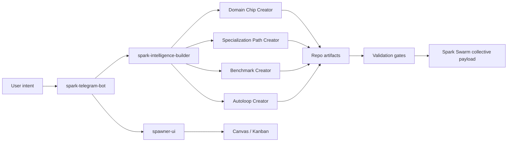

# Spark Creator System

This folder is the agent-readable methodology hub for creating Spark domain chips, benchmarks, specialization paths, autoloops, and Swarm-publishable mastery loops.

The goal is not to make one large creator repo do everything. The goal is to give Spark agents a stable set of contracts so a user can say what they want from Telegram, Builder, Spawner UI, Canvas, or a local repo, and Spark can produce a high-quality, benchmarked, Swarm-compatible system without guessing.

## Documents

| Document | Purpose |
| --- | --- |
| [CREATOR_SYSTEM_COMMUNITY_HANDOFF_2026-05-01.md](CREATOR_SYSTEM_COMMUNITY_HANDOFF_2026-05-01.md) | Current comprehensive handoff: completed work, diagrams, connection systems, planning status, gaps, and community publishing path. |
| [CREATOR_SYSTEM_PRD_V1.md](CREATOR_SYSTEM_PRD_V1.md) | Comprehensive PRD for the creator system, including users, artifact contracts, benchmark architecture, trust lanes, requirements, and phased roadmap. |
| [CREATOR_SYSTEM_FLOWCHARTS.md](CREATOR_SYSTEM_FLOWCHARTS.md) | Mermaid diagram source for lifecycle, repo ownership, evidence ladder, benchmark tiers, autoloop gates, and Startup YC reference flow. |
| [CREATOR_SYSTEM_RESEARCH_LEDGER.md](CREATOR_SYSTEM_RESEARCH_LEDGER.md) | Practical research ledger from Startup YC, Startup Bench, agentic simulator, Founder Arena, Builder, Spawner, Telegram, and Spark Swarm. |
| [ADAPTIVE_CREATOR_LOOP_STANDARD.md](ADAPTIVE_CREATOR_LOOP_STANDARD.md) | The adaptive loop standard: domain-specific adapters, reusable evidence gates, recursive standard evolution, and the first runnable creator-run contract. |
| [CREATOR_SYSTEM_MASTER_PLAN.md](CREATOR_SYSTEM_MASTER_PLAN.md) | Cohesive product and architecture plan for the creator ecosystem. |
| [CREATOR_SYSTEM_PROOF_DOMAINS.md](CREATOR_SYSTEM_PROOF_DOMAINS.md) | Multi-domain proof layers for artifact quality, tool operation, content simulation, doctor security, Startup YC, and future memory/retrieval examples. |
| [CREATOR_RUN_PRODUCTION_READINESS_V1.md](CREATOR_RUN_PRODUCTION_READINESS_V1.md) | Shippable creator-run CLI contract, smoke-result schema, integration rules, and V1 ship gate. |
| [CREATOR_RUN_GOLDEN_PATH_V1.md](CREATOR_RUN_GOLDEN_PATH_V1.md) | CLI-first golden path from user goal to creator-run validation, doctor repair plan, and strict publication check. |
| [PROMOTION_GATES_AND_EVIDENCE_TIERS.md](PROMOTION_GATES_AND_EVIDENCE_TIERS.md) | Canonical evidence-tier ladder, promotion gates, claim boundaries, and Startup YC seeded-variance reference pattern. |
| [PHASE_2_PRODUCT_FLOW_BACKLOG.md](PHASE_2_PRODUCT_FLOW_BACKLOG.md) | Deferred Builder, Telegram, Spawner UI, Canvas, and Kanban integration contract for when product surfaces are ready. |
| [AGENT_CREATOR_PLAYBOOK.md](AGENT_CREATOR_PLAYBOOK.md) | Step-by-step operating procedure for a Spark agent creating a new chip/path/benchmark/loop. |
| [BENCHMARK_AND_AUTOLOOP_PROTOCOL.md](BENCHMARK_AND_AUTOLOOP_PROTOCOL.md) | Benchmark types, scoring reliability rules, and autoloop promotion gates. |
| [TELEGRAM_BUILDER_SPAWNER_CREATOR_FLOW.md](TELEGRAM_BUILDER_SPAWNER_CREATOR_FLOW.md) | How Telegram, Spark Intelligence Builder, Spawner UI, Canvas, Kanban, and Spark Swarm should work together. |
| [schemas/](schemas/) | JSON Schema anchors for creator intent, adapter map, smoke, doctor, template-check, and Swarm packet outputs. |
| [templates/creator-run/](templates/creator-run/) | Fill-in templates for intent packets, adapter maps, creator run reports, Swarm packets, and standard-change proposals. |
| [examples/startup-yc-creator-run/](examples/startup-yc-creator-run/) | Real Startup YC fixture that maps the existing domain chip, specialization path, benchmark, autoloop, absorption reports, and Swarm packet into the creator-run contract. |

## Current Architecture Decision

Keep the creator systems separate, but contract-bound:



Domain Chip Creator should not own Autoloop Creator. It should emit chip-specific loop metadata and hook contracts. Autoloop Creator owns loop governance, mutation windows, benchmark gates, evidence lineage, and stopping rules across all domains.

## Agent Loading Rule

When an agent is asked to create or improve a Spark creator system, load this folder first, then load repo-specific implementation docs only as needed:

- `spark-domain-chip-labs/docs/creator_system/CREATOR_SYSTEM_PRD_V1.md`
- `spark-domain-chip-labs/docs/creator_system/ADAPTIVE_CREATOR_LOOP_STANDARD.md`
- `spark-domain-chip-labs/docs/creator_system/PROMOTION_GATES_AND_EVIDENCE_TIERS.md`
- `spark-domain-chip-labs/docs/creator_system/CREATOR_SYSTEM_FLOWCHARTS.md`
- `spark-domain-chip-labs/docs/creator_system/CREATOR_SYSTEM_RESEARCH_LEDGER.md`

- `spark-intelligence-builder/docs/DOMAIN_CHIP_ATTACHMENT_CONTRACT_V1.md`
- `spark-intelligence-builder/docs/SPECIALIZATION_PATH_RUNTIME_CONTRACT_V1.md`
- `spark-intelligence-builder/docs/SPARK_RESEARCHER_INTEGRATION_CONTRACT_V1.md`
- `spark-intelligence-builder/docs/SWARM_AGENT_OPERABILITY_CONTRACT_V1.md`
- `spark-telegram-bot/README.md`
- `spawner-ui/docs/SPARK_MISSION_CONTROL_TRACE.md`

## First Runnable Commands

The first executable slice lives in this repo as a conservative smoke gate:

```bash
python -m chip_labs.cli creator-run-init \
  --output-dir runs/startup-yc-creator-run \
  --domain "Startup YC" \
  --goal "Create a benchmarked Startup YC specialization path"

python -m chip_labs.cli creator-run-smoke runs/startup-yc-creator-run
```

Validate the creator-run template set before generating new runs:

```bash
python -m chip_labs.cli creator-run-template-check --fail-on-blocked
```

The Startup YC reference fixture should already pass:

```bash
python -m chip_labs.cli creator-run-smoke docs/creator_system/examples/startup-yc-creator-run
```

When a run is incomplete or blocked, ask for a repair plan:

```bash
python -m chip_labs.cli creator-run-doctor runs/startup-yc-creator-run
```

For CI, bot, and UI workflows that should fail when a run is blocked:

```bash
python -m chip_labs.cli creator-run-smoke runs/startup-yc-creator-run --fail-on-blocked
```

For strict publication gates that should also fail on warnings:

```bash
python -m chip_labs.cli creator-run-smoke runs/startup-yc-creator-run --fail-on-blocked --fail-on-warn
```

For generated runs that include provenance-tagged benchmark reports, recompute
saved evidence from current source artifacts:

```bash
python -m chip_labs.cli creator-run-smoke runs/startup-yc-creator-run --recompute --fail-on-blocked
```

The smoke response emits `schema_version: adaptive_creator_loop.smoke_result.v1` and includes machine-routing fields:

- `status_counts`: count of pass/warn/fail checks
- `blocking_checks`: failed check names
- `warning_checks`: warning check names
- `automation.blocked`: whether the run is blocked
- `automation.ci_exit_code`: suggested CI status
- `automation.recommended_next_command`: concise next command or action for builders, Telegram bot, Spawner UI, and Spark Intelligence Builder

The smoke verdict is intentionally narrow:

- `blocked`: required schema or foundation fields are invalid.
- `prototype`: intent and adapters exist, but core chip/path/benchmark/autoloop artifacts are missing.
- `ready_for_baseline`: core artifacts exist and the next step is benchmark execution.
- `ready_for_swarm_packet`: reports and Swarm packet artifacts exist; review provenance, traps, privacy, and rollback before network publication.

For elevated evidence tiers such as `candidate_review`, the smoke gate also validates report semantics:

- baseline and candidate reports have numeric mean scores
- candidate delta is positive and beats baseline
- absorption modes are present and scored
- validated-pack absorption delta is positive
- trap-band coverage exists
- Swarm packet tier and delta match the reports
- Swarm packet includes source provenance and rollback/deprecation policy

`--recompute` adds a stricter distinction: saved report evidence can be coherent
on its own, while recomputed evidence must also match current benchmark cases and
scoring hooks. This mode currently supports generator-produced reports with
`creator_generator_v1` provenance.

Generator acceptance currently covers several Spark-useful proof domains:
design-doc/PR artifact quality, safe local tool operation, MiroFish-style
content simulation with multi-RLM judge batches, Spark doctor adversarial
checks, and Startup YC operator advice.
Each generated proof remains `candidate_review` only.

The first local artifact-quality scorer is available as:

```bash
python -m chip_labs.cli artifact-quality-score \
  --input docs/creator_system/examples/artifact-quality/good_design_pr.md \
  --artifact-kind pr_writeup \
  --output reports/artifact-quality.json \
  --markdown-output reports/artifact-quality.md
```

It checks evidence completeness for design docs, PR writeups, handoffs, and
mission packets. It does not prove product correctness or replace human review.

The first local content-simulation harness is available as:

```bash
python -m chip_labs.cli mirofish-content-simulate --input content-candidates.json
```

For quick agent use, pass candidates directly:

```bash
python -m chip_labs.cli mirofish-content-simulate --task "Pick the best title" --candidate "Option A" --candidate "Option B"
```

For Spark-style routing, ask for a route packet before running the simulator:

```bash
python -m chip_labs.cli mirofish-content-route --task "Pick the best title" --candidate "Option A" --candidate "Option B" --no-simulation
```

For `transfer_supported` and higher, the gate also requires `reports/transfer_summary.json` and a matching `simulator_or_arena_result` in the Swarm packet, with positive transfer delta and passed constraints.

If a run includes `reports/broad_transfer_probe.json`, the smoke gate validates it as a claim boundary. A negative broad probe warns at `transfer_supported`, because a focused transfer can still be real and useful. The same negative broad probe blocks `network_absorbable` and `standard_update`, because other agents should not absorb broad mastery or creator-methodology changes from evidence that fails wider transfer.
