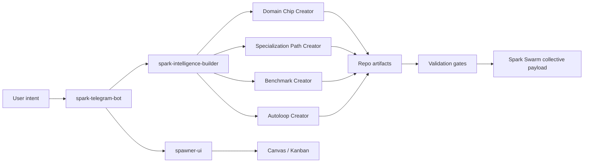

# Spark Creator System

This folder is the agent-readable methodology hub for creating Spark domain chips, benchmarks, specialization paths, autoloops, and Swarm-publishable mastery loops.

The goal is not to make one large creator repo do everything. The goal is to give Spark agents a stable set of contracts so a user can say what they want from Telegram, Builder, Spawner UI, Canvas, or a local repo, and Spark can produce a high-quality, benchmarked, Swarm-compatible system without guessing.

## Documents

| Document | Purpose |
| --- | --- |
| [CREATOR_SYSTEM_PRD_V1.md](CREATOR_SYSTEM_PRD_V1.md) | Comprehensive PRD for the creator system, including users, artifact contracts, benchmark architecture, trust lanes, requirements, and phased roadmap. |
| [CREATOR_SYSTEM_FLOWCHARTS.md](CREATOR_SYSTEM_FLOWCHARTS.md) | Mermaid diagram source for lifecycle, repo ownership, evidence ladder, benchmark tiers, autoloop gates, and Startup YC reference flow. |
| [CREATOR_SYSTEM_RESEARCH_LEDGER.md](CREATOR_SYSTEM_RESEARCH_LEDGER.md) | Practical research ledger from Startup YC, Startup Bench, agentic simulator, Founder Arena, Builder, Spawner, Telegram, and Spark Swarm. |
| [ADAPTIVE_CREATOR_LOOP_STANDARD.md](ADAPTIVE_CREATOR_LOOP_STANDARD.md) | The adaptive loop standard: domain-specific adapters, reusable evidence gates, recursive standard evolution, and the first runnable creator-run contract. |
| [CREATOR_SYSTEM_MASTER_PLAN.md](CREATOR_SYSTEM_MASTER_PLAN.md) | Cohesive product and architecture plan for the creator ecosystem. |
| [AGENT_CREATOR_PLAYBOOK.md](AGENT_CREATOR_PLAYBOOK.md) | Step-by-step operating procedure for a Spark agent creating a new chip/path/benchmark/loop. |
| [BENCHMARK_AND_AUTOLOOP_PROTOCOL.md](BENCHMARK_AND_AUTOLOOP_PROTOCOL.md) | Benchmark types, scoring reliability rules, and autoloop promotion gates. |
| [TELEGRAM_BUILDER_SPAWNER_CREATOR_FLOW.md](TELEGRAM_BUILDER_SPAWNER_CREATOR_FLOW.md) | How Telegram, Spark Intelligence Builder, Spawner UI, Canvas, Kanban, and Spark Swarm should work together. |
| [templates/creator-run/](templates/creator-run/) | Fill-in templates for intent packets, adapter maps, creator run reports, Swarm packets, and standard-change proposals. |
| [examples/startup-yc-creator-run/](examples/startup-yc-creator-run/) | Real Startup YC fixture that maps the existing domain chip, specialization path, benchmark, autoloop, absorption reports, and Swarm packet into the creator-run contract. |

## Current Architecture Decision

Keep the creator systems separate, but contract-bound:



Domain Chip Creator should not own Autoloop Creator. It should emit chip-specific loop metadata and hook contracts. Autoloop Creator owns loop governance, mutation windows, benchmark gates, evidence lineage, and stopping rules across all domains.

## Agent Loading Rule

When an agent is asked to create or improve a Spark creator system, load this folder first, then load repo-specific implementation docs only as needed:

- `spark-domain-chip-labs/docs/creator_system/CREATOR_SYSTEM_PRD_V1.md`
- `spark-domain-chip-labs/docs/creator_system/ADAPTIVE_CREATOR_LOOP_STANDARD.md`
- `spark-domain-chip-labs/docs/creator_system/CREATOR_SYSTEM_FLOWCHARTS.md`
- `spark-domain-chip-labs/docs/creator_system/CREATOR_SYSTEM_RESEARCH_LEDGER.md`

- `spark-intelligence-builder/docs/DOMAIN_CHIP_ATTACHMENT_CONTRACT_V1.md`
- `spark-intelligence-builder/docs/SPECIALIZATION_PATH_RUNTIME_CONTRACT_V1.md`
- `spark-intelligence-builder/docs/SPARK_RESEARCHER_INTEGRATION_CONTRACT_V1.md`
- `spark-intelligence-builder/docs/SWARM_AGENT_OPERABILITY_CONTRACT_V1.md`
- `spark-telegram-bot/README.md`
- `spawner-ui/docs/SPARK_MISSION_CONTROL_TRACE.md`

## First Runnable Commands

The first executable slice lives in this repo as a conservative smoke gate:

```bash
python -m chip_labs.cli creator-run-init \
  --output-dir runs/startup-yc-creator-run \
  --domain "Startup YC" \
  --goal "Create a benchmarked Startup YC specialization path"

python -m chip_labs.cli creator-run-smoke runs/startup-yc-creator-run
```

The Startup YC reference fixture should already pass:

```bash
python -m chip_labs.cli creator-run-smoke docs/creator_system/examples/startup-yc-creator-run
```

The smoke verdict is intentionally narrow:

- `blocked`: required schema or foundation fields are invalid.
- `prototype`: intent and adapters exist, but core chip/path/benchmark/autoloop artifacts are missing.
- `ready_for_baseline`: core artifacts exist and the next step is benchmark execution.
- `ready_for_swarm_packet`: reports and Swarm packet artifacts exist; review provenance, traps, privacy, and rollback before network publication.

For elevated evidence tiers such as `candidate_review`, the smoke gate also validates report semantics:

- baseline and candidate reports have numeric mean scores
- candidate delta is positive and beats baseline
- absorption modes are present and scored
- validated-pack absorption delta is positive
- trap-band coverage exists
- Swarm packet tier and delta match the reports
- Swarm packet includes source provenance and rollback/deprecation policy
