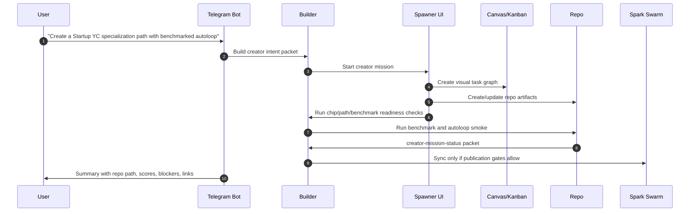

# Telegram, Builder, Spawner, Canvas, And Swarm Creator Flow

## Purpose

This document defines how the user-facing creator flow should work when creation starts from Telegram, Builder CLI, Spawner UI, Canvas, or Kanban.

The goal is for a normal user to ask for a domain chip, benchmark, specialization path, or autoloop, then get a trackable mission with real validation and a clear path into Spark Swarm.

## Current Status

This is a product-flow design document, not the shipped V1 surface.

The shippable V1 contract currently lives in `creator-run-init`, `creator-run-template-check`, `creator-run-smoke`, `creator-run-doctor`, the creator-run schemas, and the Startup YC reference fixture. Product wiring should be picked up from [PHASE_2_PRODUCT_FLOW_BACKLOG.md](PHASE_2_PRODUCT_FLOW_BACKLOG.md) after Builder, memory, conversations, Telegram interactions, Spawner UI, Canvas, and Kanban are ready for the surface.

The current product-safe bridge is `creator-mission-status`. It reads saved
reports and emits a read-only mission status packet for Builder, Telegram,
Spawner, Canvas, and Kanban. Product repos should consume that packet before
they add runtime creator controls.
The packet also preserves smoke `evidence_mode`, so product surfaces can show
whether status came from saved evidence or a fresh recompute without parsing raw
smoke output.

## Current System Facts

The current stack already has these surfaces:

- `spark-telegram-bot` owns Telegram ingress and token ownership.
- `spark-intelligence-builder` owns runtime identity, domain chip attachment, provider config, and Swarm readiness.
- `spawner-ui` owns missions, PRD/task analysis, Canvas loading, Kanban, and trace state.
- `spark-canvas` can represent visual planning boards and objects through an agent API.
- `spark-domain-chip-labs` owns chip methodology, rubrics, and creator research.
- `spark-swarm` owns collective sync, insights, masteries, upgrades, and evolution modes.

The missing layer is a canonical creator mission that connects these surfaces.

## Ideal Telegram Flow



## Product Commands

### Telegram

Current commands:

- `/chip create <brief>`
- `/loop <chip_key> [rounds]`
- `/schedule "<cron>" loop <chipKey> [rounds]`
- `/run <goal>`
- `/board`
- `/mission status|pause|resume|kill <missionId>`

Recommended creator commands:

```text
/creator plan <brief>
/creator build <brief>
/creator benchmark <path_or_chip>
/creator loop <path_key> [rounds]
/creator publish <path_key>
/creator doctor <path_key_or_repo>
```

Natural language should route to these only when intent is clear. Vague "maybe build a chip" discussion should stay conversational until the user confirms creation.

### Builder CLI

Builder should expose stable machine-readable commands:

```text
spark-intelligence creator plan --brief <file> --json
spark-intelligence creator build --plan <file> --json
spark-intelligence creator validate --repo <path> --json
spark-intelligence creator benchmark --repo <path> --json
spark-intelligence creator loop --repo <path> --rounds 1 --json
spark-intelligence creator publish --repo <path> --json
```

These can wrap existing lower-level commands:

- `chips create`
- `loops run`
- `attachments snapshot`
- `swarm doctor`
- `swarm sync`

### Spawner UI

Spawner should create a mission for creator work instead of burying it inside chat.

Creator mission stages:

1. intent packet
2. repo/artifact plan
3. domain chip scaffold
4. benchmark pack scaffold
5. specialization-path scaffold
6. autoloop policy scaffold
7. validation
8. Swarm readiness
9. GitHub PR or local-only handoff

Each stage should produce task events for Kanban.

### Canvas/Kanban

Canvas should show the artifact graph:

- domain chip
- benchmark pack
- specialization path
- autoloop policy
- Swarm payload
- GitHub PR or local repo state

Kanban should show stage state:

- queued
- running
- blocked
- needs user input
- validated
- published

Blocked states must be explicit:

- missing provider key
- benchmark missing
- no mutation target
- Swarm auth missing
- GitHub publish unavailable
- held-out regression
- no candidates

## Creator Trace Contract

Every creator mission should write one trace object. Until product repos own a
runtime trace endpoint, this trace is derived from
`adaptive_creator_loop.creator_mission_status.v1`:

```json
{
  "schema_version": "adaptive_creator_loop.creator_mission_status.v1",
  "mission_id": "",
  "request_id": "",
  "creator_mode": "domain_chip|specialization_path|benchmark|autoloop|full_path",
  "user_goal": "",
  "repo_root": "",
  "artifacts": [],
  "current_stage": "",
  "stage_status": "queued|running|blocked|validated|failed|published",
  "canonical": {
    "verdict": "prototype|ready_for_baseline|ready_for_swarm_packet|blocked",
    "evidence_tier": "local_only|candidate_review|transfer_supported",
    "automation": {}
  },
  "publication": {
    "publish_mode": "local_only|github_pr|swarm_shared",
    "swarm_shared_allowed": false,
    "network_absorbable": false
  },
  "surface_adapters": {
    "builder": {},
    "telegram": {},
    "spawner": {},
    "canvas": {},
    "kanban": {}
  },
  "links": {
    "canvas": "",
    "kanban": "",
    "repo": "",
    "pull_request": ""
  }
}
```

Telegram, Canvas, and Kanban should read this same packet rather than each
summarizing from separate state.

## User Experience Principles

### Make Creation Feel Like A Mission

The user should see:

- what Spark is building
- which files/repos are being touched
- what benchmark will prove quality
- what is blocked
- what passed
- what is safe to publish

### Avoid Slash Command Dependence

Slash commands are useful for power users. Normal users should be able to say:

- "Make me a domain chip for investor diligence."
- "Turn this into a specialization path."
- "Benchmark this against real cases."
- "Run one safe loop and show me if it improved."
- "Publish the validated insight to Swarm."

Telegram should translate the request into a creator intent packet and ask for confirmation only when authority or privacy changes.

### Keep Privacy And Publish Mode Visible

Every creator mission should declare:

| Mode | Meaning |
| --- | --- |
| `local_only` | Artifacts stay on machine. |
| `github_pr` | Changes can be pushed as PRs. |
| `swarm_shared` | Benchmark-backed packets can sync to Spark Swarm. |

No mission should silently move from local to shared.

## Integration With Spark Swarm

A specialization path is Swarm-ready when:

- `specialization-path.json` exists
- default scenario exists
- mutation target exists
- benchmark can run
- collective payload can be generated
- evidence lane is declared
- workspace id is configured
- publish mode is explicit

The Swarm payload should contain:

- insight
- mastery candidate
- benchmark strength
- contradiction or weak-track notes
- upgrade recommendation if code/docs should change

## Immediate Implementation Backlog

1. Add `creator-mission-status` packet consumer in Builder.
2. Add `creator plan` schema and CLI stub in Builder.
3. Add creator mission type in Spawner UI.
4. Add Telegram natural-language routing for creator missions.
5. Add creator trace endpoint in Spawner UI.
6. Add Canvas/Kanban rendering for creator artifacts and benchmark gates.
7. Add Startup YC as the golden reference path.
8. Add creator acceptance tests:
   - chip hooks run
   - benchmark baseline runs
   - loop keep/revert works
   - Swarm readiness reports blockers
   - Telegram mission summary links to Kanban/Canvas

## Best Next Product Move

Build the first end-to-end creator mission around Startup YC:

```text
User asks in Telegram
-> Spark creates creator intent packet
-> Spawner opens a creator mission
-> Builder validates existing Startup YC chip/path/bench
-> one loop runs against Startup Bench or Founder Arena
-> creator-mission-status emits read-only surface adapters
-> result appears in Kanban/Canvas
-> validated packet is reviewed for Spark Swarm sharing
```

Once that works, every other domain can copy the same path.
